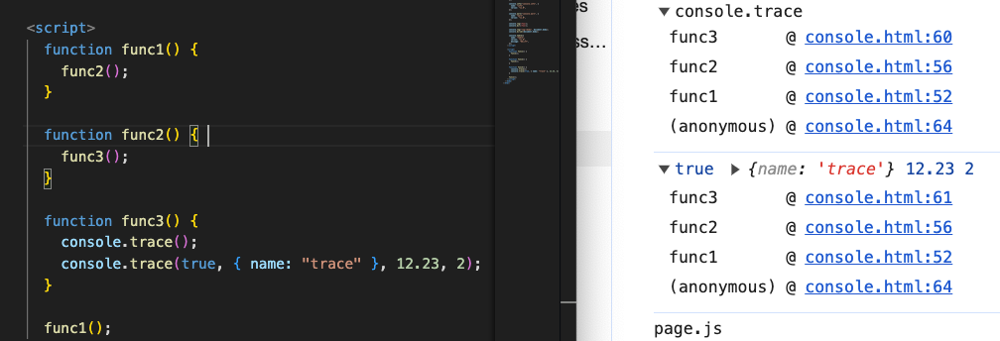

# console.trace()

## 概述

+ `console.trace()` 是用于在控制台输出当前的调用栈的方法。

+ 调用 `console.trace()` 会在控制台中显示当前 JavaScript 执行路径的函数调用栈信息，包括函数的调用顺序和调用位置。

+ 这对于调试代码时追踪函数的调用路径和了解代码执行的流程非常有用。通过调用 `console.trace()` ，开发人员可以快速了解代码的执行过程，并找到导致问题的函数调用路径

  
