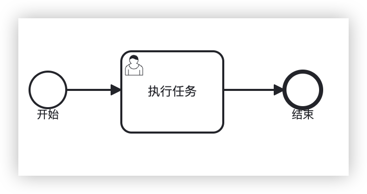

# BPMN2.0结构

## BPMN 2.0 与 XML

+ 当流程被转成 XML 时，所有的流程节点信息最终都会包含在一个 Definition 定义节点 中，比如上图中的流程：

  

+ 当它转换为 XML 时，则体现为如下格式：

  ```xml
  <?xml version="1.0" encoding="UTF-8"?>
  <definitions xmlns="http://www.omg.org/spec/BPMN/20100524/MODEL" xmlns:bpmndi="http://www.omg.org/spec/BPMN/20100524/DI" xmlns:omgdc="http://www.omg.org/spec/DD/20100524/DC" xmlns:omgdi="http://www.omg.org/spec/DD/20100524/DI" xmlns:xsi="http://www.w3.org/2001/XMLSchema-instance" targetNamespace="http://bpmn.io/schema/bpmn">
    <process id="Process_1" isExecutable="true">
      <startEvent id="StartEvent_1" name="开始" />
      <userTask id="UserTask_1" name="执行任务" />
      <endEvent id="EndEvent_1" name="结束" />
      <sequenceFlow id="Flow_1" sourceRef="StartEvent_1" targetRef="UserTask_1" />
      <sequenceFlow id="Flow_2" sourceRef="UserTask_1" targetRef="EndEvent_1" />
    </process>
    <bpmndi:BPMNDiagram id="BPMNDiagram_1">
      <bpmndi:BPMNPlane id="BPMNPlane_1" bpmnElement="Process_1">
        <bpmndi:BPMNShape id="StartEvent_1_di" bpmnElement="StartEvent_1">
          <omgdc:Bounds x="150" y="100" width="36" height="36" />
        </bpmndi:BPMNShape>
        <bpmndi:BPMNShape id="UserTask_1_di" bpmnElement="UserTask_1">
          <omgdc:Bounds x="240" y="80" width="100" height="80" />
        </bpmndi:BPMNShape>
        <bpmndi:BPMNShape id="EndEvent_1_di" bpmnElement="EndEvent_1">
          <omgdc:Bounds x="400" y="100" width="36" height="36" />
        </bpmndi:BPMNShape>
        <bpmndi:BPMNEdge id="Flow_1_di" bpmnElement="Flow_1">
          <omgdi:waypoint x="186" y="118" />
          <omgdi:waypoint x="240" y="118" />
        </bpmndi:BPMNEdge>
        <bpmndi:BPMNEdge id="Flow_2_di" bpmnElement="Flow_2">
          <omgdi:waypoint x="340" y="118" />
          <omgdi:waypoint x="400" y="118" />
        </bpmndi:BPMNEdge>
      </bpmndi:BPMNPlane>
    </bpmndi:BPMNDiagram>
  </definitions>
  ```

+ 一个完整的 BPMN 图，转换成 XML 后，它的 Business Process Model 业务流程模型 与 DI 都包含在一个 Definition 节点中

  + 其中 业务流程模型 数据包含在一个 process 或者 collaboration 节点中，用于 定义业务配置与流向；
  + 与 图显示 相关的部分，则位于 bpmndi 定义的 BPMNDiagram 中，两者通过 id 属性进行关联

## DI

+ BPMN DI（BPMN Diagram Interchange，BPMN 图形转换）

+ BPMN DI 的诞生本身就位为了促进 BPMN 图 与 XML 之间的互相转换，并且为了保证转换后的 准确和清晰，BPMN DI 内部根据 OMG Diagram Definition (DD，图元定义) 划分了两种 元模型（meta-model） 类型：

  1. Diagram Commons (DC)：定义了常见的类型，例如边界和字体
  2. Diagram Interchange (DI)：提供了用于定义特定于领域的图模型的框架，而 BPMN DI 即是从 DI 类型中派生出来的
