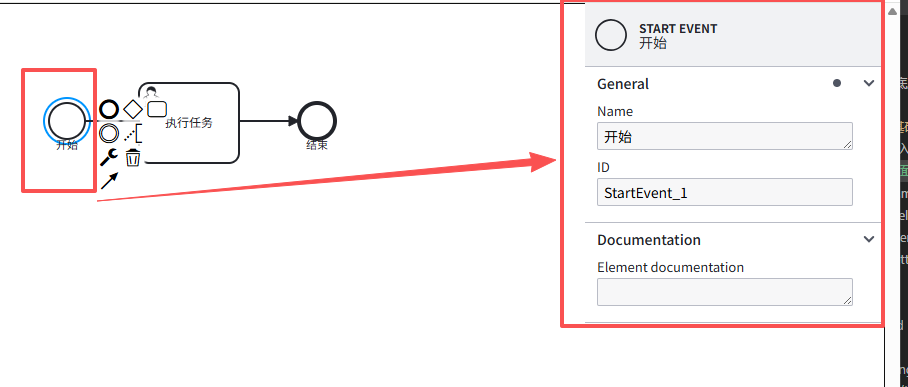

# 增加控制面板

## 加入properties-panel

+ 显示控制面板

  

+ 导入相关库：

  ```js
  "bpmn-js-properties-panel": "^5.42.0",
  "@bpmn-io/properties-panel": "^3.33.0"
  ```

  ```js
  // 由于bpmn-js-properties-panel库，并不支持ts，所以，为了方便，这里直接修改一下tsconfig的配置，tsconfig.app.json加下面的属性
  "compilerOptions": {
    "skipLibCheck": true,
    "noImplicitAny": false,
  },
  ```

  ```html
  <template>
    <div class="containers">
      <div class="canvas" ref="canvasRef" />
      <div class="panel" id="js-properties-panel"></div>
    </div>
  </template>

  <script setup lang="ts">
  import { ref, onMounted, onBeforeUnmount } from "vue";
  import Modeler from "bpmn-js/lib/Modeler";
  import { xmlStr } from "../mock/xmlStr";
  import type Canvas from "diagram-js/lib/core/Canvas";

  // 左边工具栏以及编辑节点的样式
  import "bpmn-js/dist/assets/diagram-js.css";
  import "bpmn-js/dist/assets/bpmn-js.css";
  import "bpmn-js/dist/assets/bpmn-font/css/bpmn-embedded.css";

  import {
    BpmnPropertiesPanelModule,
    BpmnPropertiesProviderModule,
  } from "bpmn-js-properties-panel";

  // 加入属性控制面板的样式
  import '@bpmn-io/properties-panel/assets/properties-panel.css';

  const canvasRef = ref<HTMLDivElement | null>(null);
  let modeler: Modeler | null = null;

  onMounted(async () => {
    if (!canvasRef.value) return;

    modeler = new Modeler({
      container: canvasRef.value,
      //添加控制板
      propertiesPanel: {
        parent: "#js-properties-panel",
      },
      additionalModules: [
        BpmnPropertiesPanelModule,
        BpmnPropertiesProviderModule,
      ],
    });

    await loadXml(xmlStr);

    // 让画布适配
    const canvas = modeler.get<Canvas>("canvas");
    canvas.zoom("fit-viewport");
  });

  async function loadXml(xml: string) {
    if (!modeler) return;
    try {
      await modeler.importXML(xml);
    } catch (e) {
      console.error("importXML error:", e);
    }
  }

  onBeforeUnmount(() => {
    modeler?.destroy();
    modeler = null;
  });
  </script>

  <style scoped>
  .containers {
    position: relative;
    background-color: #ffffff;
    width: 100%;
    height: calc(100vh - 52px);
  }
  .canvas {
    width: 100%;
    height: 100%;
  }
  .panel {
    position: absolute;
    right: 0;
    top: 0;
    width: 300px;
  }
  button {
    padding: 6px 10px;
    border: 1px solid #ccc;
    background: #fff;
    border-radius: 4px;
    cursor: pointer;
  }
  button:hover {
    background: #f6f6f6;
  }
  </style>
  ```

