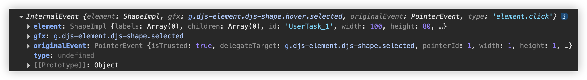

# 监听element并绑定事件

## 概述

+ 也需要监听用户点击图形上的element或者监听某个element改变:

  + element.click 点击元素;
  + element.changed 当元素发生改变的时候(包括新增、移动、删除元素)

  ```js
  import type EventBus from "diagram-js/lib/core/EventBus";

  function eventBusListener() {

    if (!modeler) return;
    const m = modeler;

    const eventBus = m.get<EventBus>("eventBus"); // 需要使用eventBus
    const eventTypes = ["element.click", "element.changed"]; // 需要监听的事件集合
    eventTypes.forEach(function (eventType) {
      eventBus.on(eventType, function (e:any) {
        console.log(e);
      });
    });
  }
  ```

+ 这样，进行元素的点击、新增、移动、删除的时候都能监听到了

+ 但是有一点很不好, 你在点击“画布”的时候, 也就是根元素也可能会触发此事件, 我们一般都不希望此时会触发, 因此我们可以在on回调中添加一些判断, 来避免掉不需要的情况:

  ```js
  eventBus.on(eventType, function (e:any) {
    if (!e || e.element.type == 'bpmn:Process') return // 这里我的根元素是bpmn:Process
    console.log(e);
  });
  ```

  

+ 它会打印出该节点的Shape信息和DOM信息等, 但我们可能只关注于Shape信息(也就是该节点的id、type等等信息), 此时我们可以使用elementRegistry来获取Shape信息:

  ```js
  eventBus.on(eventType, function (e: any) {
    if (!e || e.element.type == "bpmn:Process") return; // 这里我的根元素是bpmn:Process
    console.log(eventType); // element.click | element.changed
    console.log(e);
    const elementRegistry = m.get<ElementRegistry>("elementRegistry");
    const shape = elementRegistry.get(e.element.id); // 传递id进去
    console.log(shape); // {Shape}
    console.log(e.element); // {Shape}
    console.log(JSON.stringify(shape) === JSON.stringify(e.element)); // true
  });
  ```

+ 或者你也可以直接就用e.element获取到Shape的信息, 我比较了一下它们两是一样的
+ 但是官方是推荐使用elementRegistry的方式
