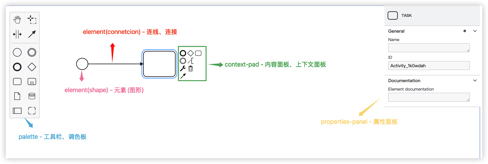

# bpmn.js 组成部分

## 概述

+ bpmn-js 是一个 BPMN 2.0 渲染工具包和 Web 建模器

  + 它使用 JavaScript 编写，可以在现代浏览器中嵌入 BPMN 2.0 图表，并且不依赖任何服务端后台
  + 这使得它能够轻松嵌入到任意 Web 应用中

+ 该库的设计既可以作为查看器（viewer），也可以作为 Web 建模器（modeler）

  + 你可以使用 viewer 将 BPMN 2.0 图表嵌入到应用中，并结合你的数据进行扩展
  + 你也可以使用 modeler 在应用内部创建 BPMN 2.0 图表

## 组成部分

+ 生产的画布可见功能主要包含以下部分

  + Palette：左侧元素工具栏，可以通过点击或者拖拽触发添加新元素
  + Shapes：所有 Bpmn.js 可见节点，Moddle 描述文件内可发现均继承自 Element
  + Connections：所有节点之间的连线，Bpmn.js 中连线的类型均为 SequenceFlow
  + ContextPad：用鼠标选中一个元素时会出现，主要是操作该元素的上下文以及节点自身的类型等
  + PopupMenu：默认在鼠标点击 ContextPad 中的扳手图表时出现，主要用于控制选中元素类型的调整等

  

+ 当然，还能加上对应节点的属性面板

  + properties-panel：需要额外添加模块面板，用鼠标选中一个元素时会出现，主要是查看或者操作该元素的对应属性。可以通过自定义扩展该节点对应xml的属性
