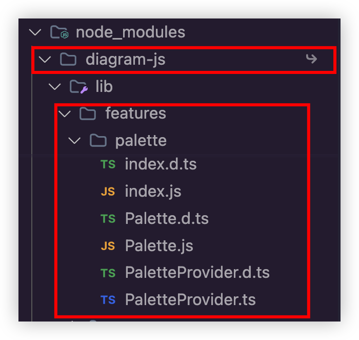
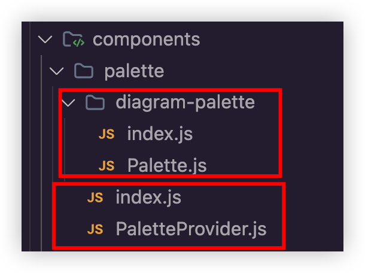
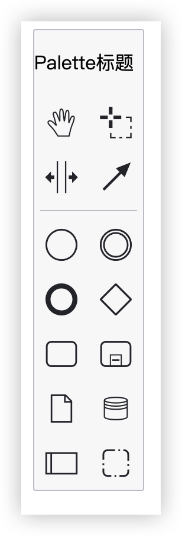
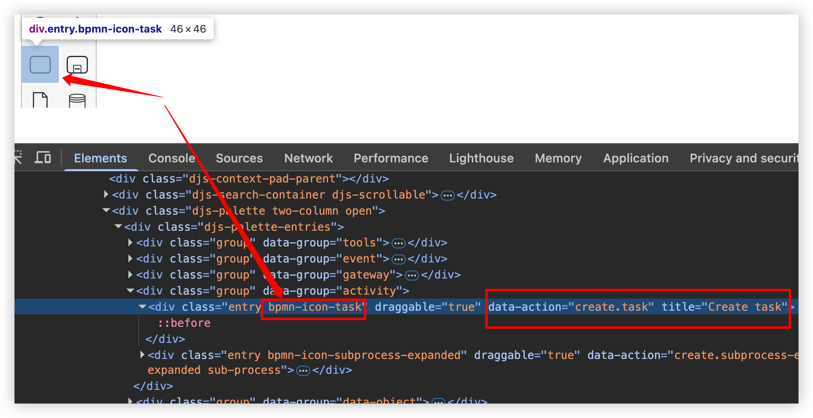
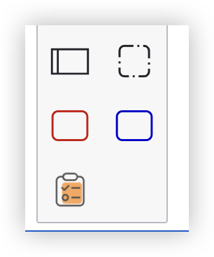
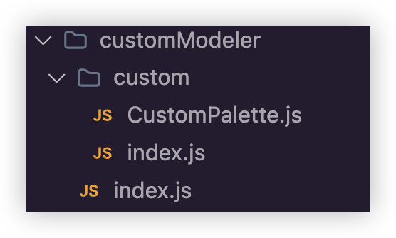

# 工具栏Palette

## 1. 简单引入处理

首先我们知道bpmn-js是封装diagram-js.

所以工具栏Palette也是有两部分.

一部分是在bpmn-js中的代码，一部分是在diagram-js

  

  

+ 我们完全可以拷贝这两部分的关键代码，到自己的代码中去，然后再进行修改，形成自定义的Palette

  

+ 其中diagram-palette文件夹下的index.js、Palette.js来自diagram-js

palette文件夹下的index.js、PaletteProvider.js来自bpmn-js

我们知道，bpmn-js是在diagram-js基础上做的处理，由于bpmn-js源码中的index.js引用了diagram-js中的代码，所以，我们稍微修改一下：

  ```js
  // 修改为当前diagram-palette目录下的内容
  import PaletteModule from './diagram-palette';
  import CreateModule from 'diagram-js/lib/features/create';
  // 源代码对space-tool做了再处理，这里直接引入diagram-js里面的即可
  import SpaceToolModule from 'diagram-js/lib/features/space-tool';
  import LassoToolModule from 'diagram-js/lib/features/lasso-tool';
  import HandToolModule from 'diagram-js/lib/features/hand-tool';
  import GlobalConnectModule from 'diagram-js/lib/features/global-connect';
  import translate from 'diagram-js/lib/i18n/translate';

  import PaletteProvider from './PaletteProvider';

  export default {
    __depends__: [
      PaletteModule,
      CreateModule,
      SpaceToolModule,
      LassoToolModule,
      HandToolModule,
      GlobalConnectModule,
      translate
    ],
    __init__: [ 'paletteProvider' ],
    paletteProvider: [ 'type', PaletteProvider ]
  };
  ```

+ 在diagram-palette/palette.js的源码中，由于依赖外部的函数，我们简单修改一下，直接写入这个函数即可：

  ```js
  // import {
  //   escapeCSS
  // } from '../../util/EscapeUtil';

  export function escapeCSS(str) {
    return CSS.escape(str);
  }
  ```

+ 在下面的代码中，我们做一个最简单的修改，加上一行标题

  ```js
  Palette.HTML_MARKUP =
  '<div class="djs-palette">' +
    '<p>Palette标题</p>' +
    '<div class="djs-palette-entries"></div>' +
    '<div class="djs-palette-toggle"></div>' +
  '</div>';
  ```

+ 然后就是在我们自定义的界面上进行引用，比如CustomPalette.vue

  ```js
  import customPalette from './palette'

  const canvasRef = ref<HTMLDivElement | null>(null);
  let modeler: Modeler | null = null;

  onMounted(async () => {
    if (!canvasRef.value) return;

    // 去除默认工具栏
    // @ts-expect-error
    const modules = Modeler.prototype._modules
    const index = modules.findIndex(it => it.paletteProvider)
    modules.splice(index, 1)

    modeler = new Modeler({
      container: canvasRef.value,
      additionalModules: [
        customPalette
        // ......
      ],
    });
  ```

+ 这样，界面就可以看到如下结果：

  

## 2.修改默认处理

+ 官方提供的工具栏中新增一个自定义的项，比如就一个红色或者蓝色的任务项

  + 元素类型: bpmn:Task
  + 样式: 沿用bpmn:Task原有的样式, 只不过将边框变为红色（蓝色）

### 编写CustomPalette.js代码

+ 导出一个类，类的名称你可以随意取, 但是在引用的时候要和类名一致

  ```js
  export default class CustomPalette {
    constructor(bpmnFactory, create, elementFactory, palette, translate) {
      this.bpmnFactory = bpmnFactory;
      this.create = create;
      this.elementFactory = elementFactory;
      this.translate = translate;

      palette.registerProvider(this);
    }
    // 这个函数就是绘制palette的核心
    getPaletteEntries(element) {
      //......
    }
  }

  CustomPalette.$inject = [
    "bpmnFactory",
    "create",
    "elementFactory",
    "palette",
    "translate",
  ];

  ```

+ 稍微解释一下：

  + 定义一个类
  + 使用$inject注入一些需要的变量
  + 在类中使用palette.registerProvider(this)指定这是一个palette

+ 定义完CustomPalette.js之后, 我们需要在其同级的index.js中将它导出

  ```js
  import CustomPalette from "./CustomPalette";

  export default {
    __init__: ["customPalette"],
    customPalette: ["type", CustomPalette],
  };

  ```

+ 这个写法，在我们之前介绍diagram-js的依赖注入(DI)中讲解过，模块使用 __init__ 钩子来声明需要立即加载的组件或需要调用的函数，type(token, Constructor)构造函数将使用 new 运算符调用以生成customPalette实例

+ 同时要在页面中使用它:

  ```js
  import customModule from "@/components/custom";

  ......

  modeler = new Modeler({
    container: canvasRef.value,
    additionalModules: [
      // 自定义的节点
      customModule,
    ],
  });
  ```

### 编写核心函数getPaletteEntries代码

+ 其实从界面上就可以看到task的css样式名：

  

+ 因此，我们只需要加上自己的样式即可，比如我们在src文件夹下，添加一个css样式(./src/css/app.css)

  ```js
  .bpmn-icon-task.red {
    color: #cc0000 !important;
  }
  .bpmn-icon-task.blue {
    color: #0000cc !important;
  }
  ```

+ 然后getPaletteEntries代码中加入：

  ```js
  getPaletteEntries(element) {
    const { bpmnFactory, create, elementFactory, translate } = this;
    return {
      "create.duyi-task-red": {
        group: "model",
        className: "bpmn-icon-task red",
        title: translate("创建一个类型为duyi-task-red的任务节点")
    },

      "create.duyi-task-blue": {
        group: "model",
        className: "bpmn-icon-task blue",
        title: translate("创建一个类型为duyi-task-blue的任务节点")
      },
    };
  }
  ```

+ 不过现在只是样式显示在上面了，还没有对应事件动作，要添加具体事件，就需要添加action

这里的核心其实就是利用bpmn.js提供的一些方法创建shape然后将其添加到画布上，我们这里创建一个简单的类型为bpmn:Task的元素(当然你也可以直接创建bpmn:StartEvent、bpmn:UserTask、bpmn:ServiceTask、bpmn:ExclusiveGateway等等)

  ```js
  getPaletteEntries(element) {
    const { bpmnFactory, create, elementFactory, translate } = this;

    function createTask() {
      return function (event) {
        const shape = elementFactory.createShape({
          type: "bpmn:Task",
        });
        console.log(shape);
        create.start(event, shape);
      };
    }
    return {
      "create.duyi-task-red": {
        group: "model",
        className: "bpmn-icon-task red",
        title: translate("创建一个类型为duyi-task-red的任务节点"),
        action: {
          dragstart: createTask(),
          click: createTask(),
        },
      },

      "create.duyi-task-blue": {
        group: "model",
        className: "bpmn-icon-task blue",
        title: translate("创建一个类型为duyi-task-blue的任务节点"),
        action: {
          dragstart: createTask(),
          click: createTask(),
        },
      },
    };
  }


  ```

+ 当然，既然能改变边框样式，那么更多的样式当然也可以，比如我们把图标该为自己设定的icon，首先加入相关css样式：

  ```js
  .icon-custom{
    border-radius:50%;
    background-size: 65%;
    background-repeat: no-repeat;
    background-position: center;
  }

  .icon-custom.duyi-task { /* 加上背景图 */
    background-image: url('../assets/task.png');
  }
  ```

+ 当然，既然能改变边框样式，那么更多的样式当然也可以，比如我们把图标该为自己设定的icon，首先加入相关css样式：

  ```js
  .icon-custom{
    border-radius:50%;
    background-size: 65%;
    background-repeat: no-repeat;
    background-position: center;
  }

  .icon-custom.duyi-task { /* 加上背景图 */
    background-image: url('../assets/task.png');
  }
  ```

+ 然后再到代码中加入icon相关的处理：

  ```js
  // ...其他代码省略
  "create.duyi-task-icon": {
    group: "model",
    className: "icon-custom duyi-task",
    title: translate("创建一个类型为duyi-task-icon的任务节点"),
    action: {
      dragstart: createTask(),
      click: createTask(),
    },
  },
  ```

+ 完整效果如下：

  

## 3.新建modeler

+ 当然前面其实还是创建新的module，然后加入到已有的modeler中，我们完全也可以自己处理modeler，创建如下的代码结构：

  

+ 改写一下CustomPalette的代码：

  ```js
  export default function PaletteProvider(
    palette,
    create,
    elementFactory,
    globalConnect
  ) {
    this.create = create;
    this.elementFactory = elementFactory;
    this.globalConnect = globalConnect;

    palette.registerProvider(this);
  }

  PaletteProvider.$inject = [
    "palette",
    "create",
    "elementFactory",
    "globalConnect",
  ];

  PaletteProvider.prototype.getPaletteEntries = function (element) {
    // 此方法和上面案例的一样
    const { create, elementFactory } = this;

    function createTask() {
      return function (event) {
        const shape = elementFactory.createShape({
          type: "bpmn:Task",
        });
        console.log(shape); // 只在拖动或者点击时触发
        create.start(event, shape);
      };
    }

    return {
      "create.duyi-task": {
        group: "model",
        className: "icon-custom duyi-task",
        title: "创建一个类型为duyi-task的任务节点",
        action: {
          dragstart: createTask(),
          click: createTask(),
        },
      },
    };
  };

  ```

+ 其实你会发现，现在的写法和源代码中就几乎一样了（参考上面的简单引入处理PaletteProvider.js源代码），只是我们简化了task action的写法而已

  ```js
  // custom/index.js
  import CustomPalette from "./CustomPalette";
  export default {
    __init__: ["paletteProvider"],
    paletteProvider: ["type", CustomPalette],
  };
  ```

  ```js
  // customModeler/index.js
  import Modeler from "bpmn-js/lib/Modeler";
  import inherits from "inherits-browser";
  import CustomModule from "./custom";

  export default function CustomModeler(options) {
    Modeler.call(this, options);
    this._customElements = [];
  }

  inherits(CustomModeler, Modeler);

  CustomModeler.prototype._modules = [].concat(CustomModeler.prototype._modules, [
    CustomModule,
  ]);
  ```

+ 这里的写法，其实可以参考源代码中bpmn-js/lib/Modeler.js的写法

inherits-browser是源代码中用到的一个工具函数库，其实inherits函数就是帮我们实现继承关系，

导出的类继承了Modeler这个核心的类, 这样就保证了其他功能的实现。

然后就可以直接在vue界面上使用一下：

  ```js
  import CustomModeler from './customModeler/index.js'

  //......
  modeler = new CustomModeler({
    container: canvasRef.value
  });
  ```

## 4.创建线节点

+ 创建线节点和createTask其实差不多，注入globalConnect，并在getPaletteEntries中加入

  ```js
  export default function PaletteProvider(
    palette,
    create,
    elementFactory,
    globalConnect
  ) {
    this.create = create;
    this.elementFactory = elementFactory;
    this.globalConnect = globalConnect;

    palette.registerProvider(this);
  }

  PaletteProvider.$inject = [
    ...
    "globalConnect",
  ];

  PaletteProvider.prototype.getPaletteEntries = function (element) {
    // 此方法和上面案例的一样
    const { ......, globalConnect } = this;

    function createConnect() {
      return {
        group: "tools",
        className: "icon-custom icon-custom-flow",
        title: "新增线",
        action: {
          click: function (event) {
            globalConnect.toggle(event);
          },
        },
      };
    }

    return {
      "create.duyi-task": {......},
      'global-connect-tool': createConnect()
    };
  };
  ```
