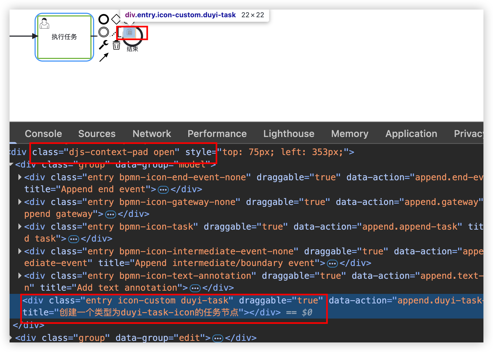

# 基础

## 在默认的ContextPad基础上修改

+ 其实自定义contextPad和palette很像, 只不过是使用contextPad.registerProvider(this)来指定它是一个contextPad, 而自定义palette是用platette.registerProvider(this)

在custom下创建CustomContextPad.js

  ```js
  export default class CustomContextPad {
    constructor(config, contextPad, create, elementFactory, injector, translate) {
      this.create = create;
      this.elementFactory = elementFactory;
      this.translate = translate;

      // autoPlace 是 bpmn-js 内置的一个服务
      // 自动计算新元素的摆放位置，并直接把新节点加到当前图上。
      // 开发者可以通过 config.autoPlace: false 禁用自动布局，改为手动拖拽
      if (config.autoPlace !== false) {
        this.autoPlace = injector.get("autoPlace", false);
      }

      contextPad.registerProvider(this); // 定义这是一个contextPad
    }

    getContextPadEntries(element) {}
  }

  CustomContextPad.$inject = [
    "config",
    "contextPad",
    "create",
    "elementFactory",
    "injector",
    "translate",
  ];

  ```

+ 同样，在index.js中加入：

  ```js
  import CustomPalette from "./CustomPalette";
  import CustomRenderer from "./CustomRenderer";
  import CustomContextPad from "./CustomContextPad";

  export default {
    __init__: ["customPalette", "customRenderer", "customContextPad"],
    customPalette: ["type", CustomPalette],
    customRenderer: ['type', CustomRenderer],
    customContextPad: ['type', CustomContextPad],
  };

  ```

+ vue界面中引入：

  ```js
  import customModule from "@/components/custom";

  //......
  modeler = new Modeler({
    container: canvasRef.value,
    additionalModules: [
      // 自定义的节点
      customModule,
    ],
  });
  ```

+ 重点还是在于getContextPadEntries这个方法, 接下来让我们来构建这个方法.

其实这个方法, 需要返回的也是一个对象, 也就是你要在contextPad这个容器里显示哪些自定义的元素, 比如我这里需要给容器里添加一个duyi-task的元素, 那么我们可以在返回的对象中添加上append.duyi-task这个属性.

  ```js
  getContextPadEntries(element) {
    const { autoPlace, create, elementFactory, translate } = this;

    function appendTask(event, element) {
      // 自动插入到默认位置
      if (autoPlace) {
        const shape = elementFactory.createShape({ type: "bpmn:Task" });
        autoPlace.append(element, shape);
      } else {
        // 进入拖拽模式，让用户自己放置
        appendTaskStart(event, element);
      }
    }

    function appendTaskStart(event) {
      const shape = elementFactory.createShape({ type: "bpmn:Task" });
      create.start(event, shape, element);
    }

    return {
      "append.duyi-task-icon": {
        group: "model",
        className: "icon-custom duyi-task",
        title: translate("创建一个类型为duyi-task-icon的任务节点"),
        action: {
          click: appendTask,
          dragstart: appendTaskStart,
        },
      }
    };
  }
  ```

+ 这里的className用的之前设置的样式，但是当我们鼠标移动上去的之后看不效果，查看一下页面效果：

  

+ 因此，我们可以手动的加上hover样式，还是在之前的app.css文件中直接加入：

  ```js
  .djs-context-pad .duyi-task.entry:hover {
    background: url('../assets/task.png') center no-repeat !important;
    background-size: cover !important;
  }
  ```

+ 其实，我们还可以定义ContextPad上的其他事件，比如编辑、删除

  ```js
  export default class CustomContextPad {
    constructor(config, contextPad, create, elementFactory, injector, translate, modeling) {
      this.create = create;
      this.elementFactory = elementFactory;
      this.translate = translate;
      this.modeling = modeling;

      // autoPlace 是 bpmn-js 内置的一个服务
      // 自动计算新元素的摆放位置，并直接把新节点加到当前图上。
      // 开发者可以通过 config.autoPlace: false 禁用自动布局，改为手动拖拽
      if (config.autoPlace !== false) {
        this.autoPlace = injector.get("autoPlace", false);
      }

      contextPad.registerProvider(this); // 定义这是一个contextPad
    }

    getContextPadEntries(element) {
      const { autoPlace, create, elementFactory, translate, modeling } = this;

      function appendTask(event, element) {
        // 自动插入到默认位置
        if (autoPlace) {
          const shape = elementFactory.createShape({ type: "bpmn:Task" });
          autoPlace.append(element, shape);
        } else {
          // 进入拖拽模式，让用户自己放置
          appendTaskStart(event, element);
        }
      }

      function appendTaskStart(event) {
        const shape = elementFactory.createShape({ type: "bpmn:Task" });
        create.start(event, shape, element);
      }

      // 编辑元素
      function editElement() {
        return {
          group: "edit",
          className: "icon-custom icon-custom-edit",
          title: translate("编辑"),
          action: {
            click: clickElement,
          },
        };
      }
      // 删除元素
      function deleteElement() {
        return {
          group: "edit",
          className: "icon-custom icon-custom-delete",
          title: translate("删除"),
          action: {
            click: removeElement,
          },
        };
      }
      // 删除功能
      function removeElement(e) {
        modeling.removeElements([element]);
      }

      function clickElement(e) {
        console.log(element, e);
      }

      return {
        "append.duyi-task-icon": {
          group: "model",
          className: "icon-custom duyi-task",
          title: translate("创建一个类型为duyi-task-icon的任务节点"),
          action: {
            click: appendTask,
            dragstart: appendTaskStart,
          },
        },
        edit: editElement(),
        delete: deleteElement(),
      };
    }
  }

  CustomContextPad.$inject = [
    "config",
    "contextPad",
    "create",
    "elementFactory",
    "injector",
    "translate",
    "modeling"
  ];

  ```


