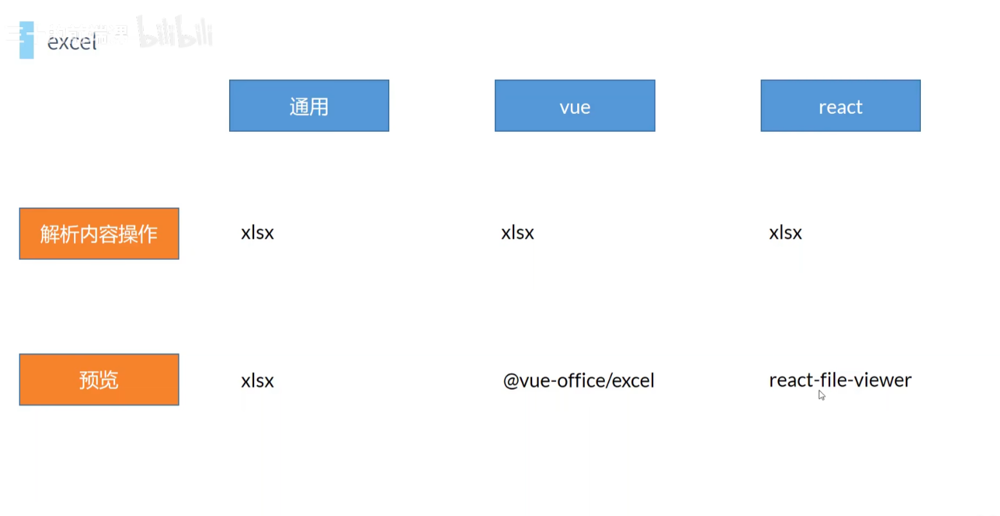

# 预览

## 库

+ `@vue-office/excel` 预览 excel
+ `@vue-office/docx` 预览 docx
+ `@vue-office/pdf` 预览 pdf

## excel 预览

+ npm

  ```sheell
  npm add -S @vue-office/excel
  ```

  

+ 使用

  ```html
  <vueofficeExcel :scr="excelSrc" :style="{height: '500px'}"></vueofficeExcel>

  <script>
    import vueofficeExcel from "@vue-office/excel";
    const excelSrc = "";
  </script>
  ```

+ src属性

  + 方式1 线上路径地址
  + 方式2：dataURL --> base64

    ```js
    // 将二进制流转成 base64

    const excelSrc = '';

    // 本地文件预览
    const onChange = (e) => {
      const file = e.target.files[0];

      const fr = new FileReader();
      fr.readAsDataURL(file);

      fr.onload = e => {
        excelSrc = e.target.result;
      }
    }
    ```
