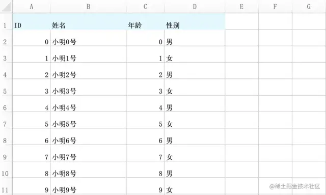
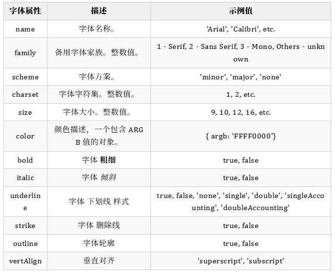
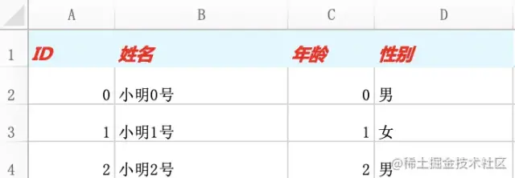
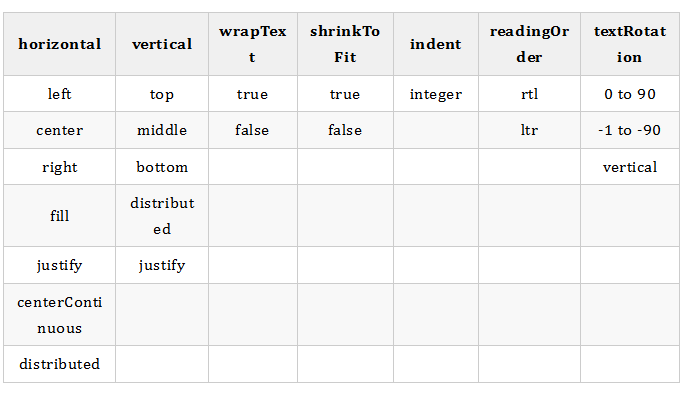

# 修改样式

## 概述

+ 单元格，行和列均支持一组丰富的样式和格式，这些样式和格式会影响单元格的显示方式

+ 通过分配以下属性来设置样式

  + numFmt
  + font 字体
  + alignment 对齐方式
  + border
  + fill 背景色

## 背景色

+ 给表头添加背景色

  ```js
  // 给表头添加背景色
  let headerRow = worksheet.getRow(1);
  headerRow.fill = {
    type: 'pattern',
    pattern: 'solid',
    fgColor: {argb: 'dff8ff'},
  }
  ```

+ 可以直接用 row.fill为整行设置背景色，这样的话这一行没有内容的单元格也会有颜色

  

+ 解决办法

  ```js
  // 通过 cell 设置背景色，更精准
  headerRow.eachCell((cell, colNum) => {
    cell.fill = {
      type: 'pattern',
      pattern: 'solid',
      fgColor: {argb: 'dff8ff'},
    }
  })
  ```

  

## 修改字体样式

+ 可以设置文字的字体、字号、颜色等属性，支持的属性如下表

  

+ 与设置背景色相同，可以通过 row 或 cell 来设置

  ```js
  修改表头的字体为微软雅黑，字号12号，颜色为红色，加粗斜体

  // 通过 cell 设置样式，更精准
  headerRow.eachCell((cell, colNum) => {
    // 设置背景色
    cell.fill = {
      type: 'pattern',
      pattern: 'solid',
      fgColor: {argb: 'dff8ff'},
    }

    // 设置字体
    cell.font = {
      bold: true,
      italic: true,
      size: 12,
      name: '微软雅黑',
      color: {argb: 'ff0000'},
    };
  })
  ```

  

## 对齐方式

+ 有效的对齐属性

  

+ 表格默认的对齐方式是靠下对齐，一般都会设置为垂直方向居中对齐，文本靠左对齐，数字靠右对齐
+ 这里为了方便都设置为水平方向靠左对齐，垂直方向居中对齐

  ```js
  // 添加行
  let rows = worksheet.addRows(list);
  rows?.forEach(row => {
    // 设置字体
    row.font = {
      size: 11,
      name: '微软雅黑',
    };
    // 设置对齐方式
    row.alignment = {vertical: 'middle', horizontal: 'left', wrapText: false,};
  })
  ```
