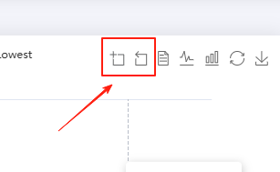

# dataZoom 数据区域缩放

## feature 之 dataZoom 数据区域缩放

+ `Object`
+ 数据区域缩放
+ 目前只支持直角坐标系的缩放

  

## 属性

+ show
+ title
+ icon
+ iconStyle
+ emphasis

  + 鼠标 hover 时候的样式

  + 属性

    + iconStyle `Object`

+ filterMode
+ xAxisIndex
+ yAxisIndex
+ brushStyle
