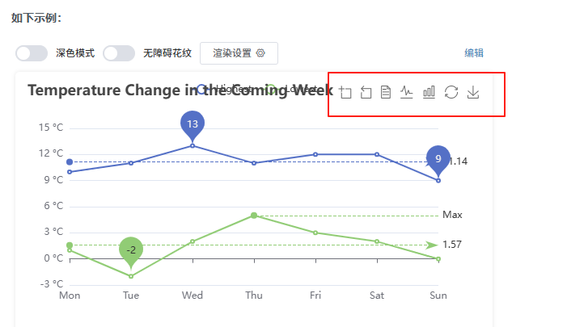

# toolbox

## 概述

+ 工具栏

  + 内置有导出图片
  + 数据视图
  + 动态类型切换
  + 数据区域缩放
  + 重置

  

## 属性

+ show
+ orient
+ itemSize
+ itemGap
+ showTitle
+ feature
+ iconStyle
+ emphasis
+ zlevel
+ z
+ left
+ tio
+ right
+ bottom
+ width
+ height
+ tooltip

