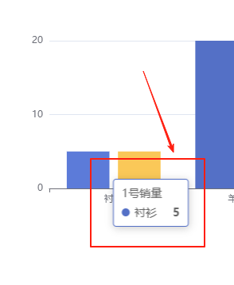

# tooltip 提示框

## 概述

+ 提示框组件

  

+ 提示框组件可以设置在多种地方：

  + 可以设置在全局，即 `tooltip` 建议

    ```js
    myChart.setOption({

      // 开启提示框
      tooltip: {},
    });
    ```

  + 可以设置在坐标系中，即 `grid.tooltip` 、 `polar.tooltip` 、 `single.tooltip`
  + 可以设置在系列中，即 `series.tooltip`
  + 可以设置在系列的每个数据项中，即 `series.data.tooltip`
