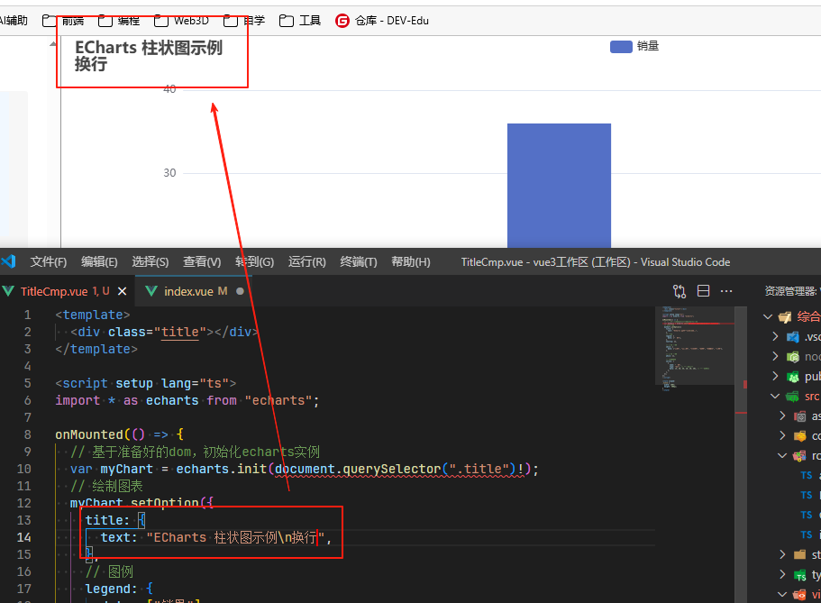
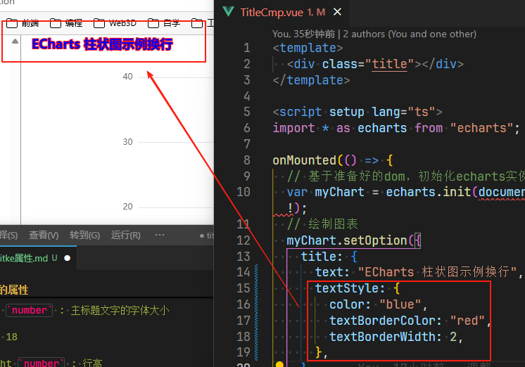

# 主标题设置

## title属性之主标题设置

+ title `string` ：主标题文本，支持使用 `\n` 换行

  

+ link `string` ：主标题文本超链接

  ```js
  title: {
    text: "ECharts 柱状图示例",
    link: "https://www.baidu.com",
  },
  ```

+ target `string` 指定窗口打开主标题超链接

  + 'self' 当前窗口打开
  + 'blank' 新窗口打开 *默认值*

+ textStyle `Object`

  + color `Color` : 主标题文字的颜色
  + fontStyle `string` 主标题文字字体的风格

    + 'normal' 默认
    + 'italic'
    + 'oblique'

  + fontWeight `string | number` 主标题文字字体的粗细

    + 'normal'
    + 'bold'
    + 'bolder' 默认
    + 'lighter'
    + 100 | 200 | 300 | 400...

  + fontFamily `string` : 主标题文字的字体系列

    + 还可以是 'serif' , 'monospace', 'Arial', 'Courier New', 'Microsoft YaHei', ...
    + 'sans-serif' 默认值

  + fontSize `number` : 主标题文字的字体大小

    +  默认值 18

  + lineHeight `number` : 行高

    + rich 中如果没有设置 lineHeight，则会取父层级的 lineHeight。例如

    ```js
    {
      lineHeight: 56,
      rich: {
        a: {
          // 没有设置 `lineHeight`，则 `lineHeight` 为 56
        }
      }
    }
    ```

  + width `number` : 文本显示宽度
  + height `number` : 文本显示高度
  + textBorderColor `Color` : 文字本身的描边颜色
  + textBorderWidth `number` : 文字本身的描边宽度

    ```js
    textStyle: {
      color: "blue",
      textBorderColor: "red",
      textBorderWidth: 2,
    },
    ```

    

  + textBorderType `string | number | Array` : 文字本身的描边类型

    + 'solid'
    + 'dashed'
    + 'dotted'
    + 自 v5.0.0 开始，也可以是 number 或者 number 数组，用以指定线条的 dash array，配合 textBorderDashOffset 可实现更灵活的虚线效果

      ```js
      {
        textBorderType: [5, 10],
        textBorderDashOffset: 5
      }
      ```

  + textBorderDashOffset `number` : 用于设置虚线的偏移量，可搭配 textBorderType 指定 dash array 实现灵活的虚线效果

    + 用于设置虚线的偏移量，可搭配 textBorderType 指定 dash array 实现灵活的虚线效果

  + textShadowColor`Color` : 文字本身的阴影颜色
  + textShadowBlur `number` : 文字本身的阴影长度
  + textShadowOffsetX `number` : 文字本身的阴影 X 偏移
  + textShadowOffsetY `number` : 文字本身的阴影 Y 偏移
  + overflow `string` : 文字超出宽度是否截断或者换行。配置width时有效

    + 'none' 默认
    + 'truncate' 截断，并在末尾显示ellipsis配置的文本，默认为...
    + 'break' 换行
    + 'breakAll' 换行，跟'break'不同的是，在英语等拉丁文中，'breakAll'还会强制单词内换行

  + ellipsis `string` : 在overflow配置为'truncate'的时候，可以通过该属性配置末尾显示的文本

    + 默认 `...`

  + rich `Object` : 在 rich 里面，可以自定义富文本样式

    + 利用富文本样式，可以在标签中做出非常丰富的效果


