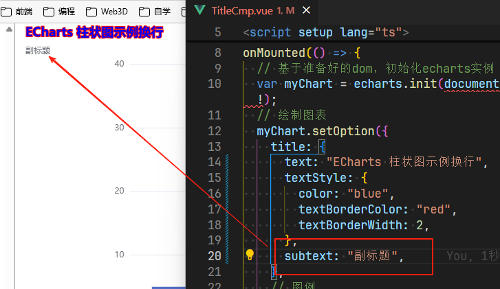

# 副标题设置

## title属性之副标题设置

+ subtext `string` : 副标题文本，支持使用 \n 换行

  

+ sublink `string` : 副标题文本超链接
+ subtarget `string` : 指定窗口打开副标题超链接

  + 'self' 当前窗口打开
  + 'blank' 新窗口打开 默认

+ subtextStyle `Object` : 类似于 textStyle

  + ...
  + align `string` 文字水平对齐方式，默认自动

    + 'left'
    + 'center'
    + 'right'
