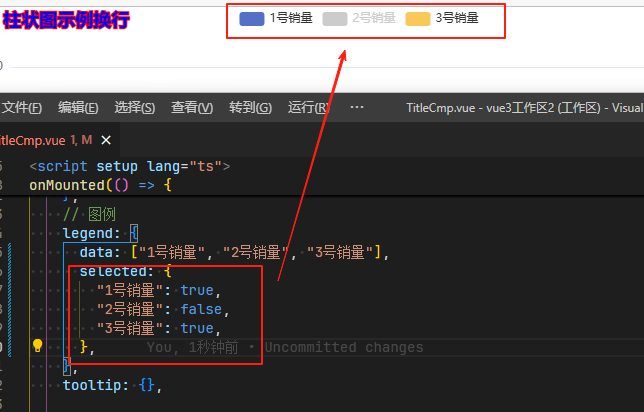

## legend 图列属性

## 概述

+ 图例组件

+ ECharts 3 中单个 echarts 实例中可以存在多个图例组件，会方便多个图例的布局

  

+ 与 series 是一一对应的

  

+ 文档 https://echarts.apache.org/zh/option.html#legend

## 所有属性

+ type图例的类型。可选值：

  + 'plain'：普通图例。 默认值
  + 'scroll'：可滚动翻页的图例。当图例数量较多时可以使用

+ id
+ show
+ zlevel
+ z
+ left
+ top
+ right
+ bottom
+ width
+ height
+ orient 图例列表的布局朝向

  + 'horizontal' 横向 默认值
  + 'vertical' 竖向

+ align
+ padding
+ itemGap `number`

  + 图例每项之间的间隔
  + 横向布局时为水平间隔，纵向布局时为纵向间隔
  + 默认为10

+ itemWidth `number`

  + 图例标记的图形宽度
  + 默认为25
    

+ itemHeight

  + 图例标记的图形高度
  + 默认为 14

+ itemStyle `Object`
+ lineStyle `Object`
+ symbolRotate
+ formatter `string | Function` 用来格式化图例文本，支持字符串模板和回调函数两种形式

  ```js
  // 使用字符串模板，模板变量为图例名称 {name}
  formatter: 'Legend {name}'

  // 使用回调函数
  formatter: function (name) {
    return 'Legend ' + name;
  }
  ```

+ selectedMode `string | boolean`

  + 图例选择的模式，控制是否可以通过点击图例改变系列的显示状态
  + 默认开启(`true`)图例选择，可以设成 `false` 关闭

  + 除此之外也可以设成

    + 'single' 单选模式
    + 'multiple' 多选模式 默认

+ inactiveColor 图例关闭时的颜色
+ inactiveBorderColor 图例关闭时的描边颜色
+ inactiveBorderWidth

+ selected 图例选中状态表(默认选中的状态)

  + 默认都为 `true`

  ```js
  selected: {
    // 选中'系列1'
    '系列1': true,
    // 不选中'系列2'
    '系列2': false
  }
  ```

    

+ textStyle `Object`

+ tooltip `Object`

  + 建议在全局中设置，不要在此设置
  + 默认不显示
  + 可以在 legend 文字很多的时候对文字做裁剪并且开启 tooltip

+ icon `string` 图例项的 icon

+ data `Array` 详见下面

+ backgroundColor
+ borderColor
+ borderWidth
+ borderRadius
+ shadowBlur
+ shadowColor
+ shadowOffsetX
+ shadowOffsetY

+ ... 详见下面

+ emphasis
+ selector
+ selectorLabel
+ selectorPosition
+ selectorItemGap
+ selectorButtonGap