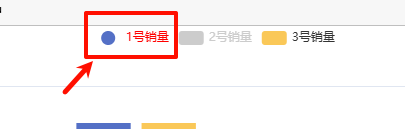

# legend属性 之 data

## data

+ `Array`

+ 图例的数据数组

  ```js
  myChart.setOption({
    // 图例
    legend: {
      data: ["1号销量", "2号销量", "3号销量"],
    },

    // 系列列表
    series: [
      {
        name: "1号销量",
        type: "bar", // 图标的类型
        data: [5, 20, 36, 10, 10, 20], // 图标的数据
      },
      {
        name: "2号销量",
        type: "bar", // 图标的类型
        data: [5, 20, 36, 10, 10, 20], // 图标的数据
      },
      {
        name: "3号销量",
        type: "bar", // 图标的类型
        data: [5, 20, 36, 10, 10, 20], // 图标的数据
      },
    ],
  });
  ```

  

+ 数组项通常为一个字符串，每一项代表一个系列的 name（如果是饼图，也可以是饼图单个数据的 name）
+ 图例组件会自动根据对应系列的图形标记（symbol）来绘制自己的颜色和标记，特殊字符串 `''`（空字符串）或者 `'\n'`（换行字符串）用于图例的换行

+ 如果 data 没有被指定，会自动从当前系列中获取

  + 多数系列会取自 series.name 或者 series.encode 的 seriesName 所指定的维度
  + 如 饼图 and 漏斗图 等会取自 series.data 中的 name

## 单独设置每一项的样式

+ 如果要设置单独一项的样式，也可以把该项写成配置项对象。此时必须使用 name 属性对应表示系列的 name

  ```js
  legend: {

    data: [{
      name: '系列1',

      // 强制设置图形为圆
      icon: 'circle',

      // 设置文本为红色
      textStyle: {
        color: 'red'
      }
    }]
  }
  ```

    

+ 属性

  + name
  + icon 图例项的 icon
  + itemStyle
  + lineStyle
  + symbolRotate
  + inactiveColor
  + inactiveBorderColor
  + inactiveBorderWidth
  + textStyle

