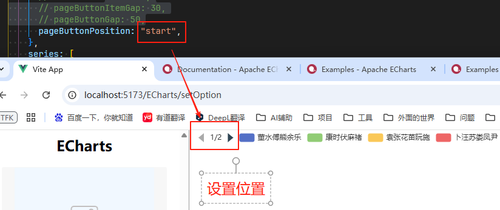

# type = scroll

## 当 type = scroll 时的配置

+ 以下 设置是 `legend.type` 为 `scroll` 时有效

  + scrollDataIndex 图例当前最左上显示项的 `dataIndex`

    + 默认值 0

    

  + pageButtonItemGap 图例控制块中，按钮和页信息之间的间隔

    + 默认值 5

    

  + pageButtonGap `number` 图例控制块和图例项之间的间隔

    + 默认值 `null`
    

  + pageButtonPosition

    + 图例控制块的位置。可选值为：

      + `'start'`：控制块在左或上
      + `'end'`：控制块在右或下 默认值

    

  + pageFormatter `string | Function` 图例控制块中，页信息的显示格式

    + 默认为 `'{current}/{total}'`，其中 `{current}` 是当前页号（从 1 开始计数），`{total}` 是总页数

    + 如果 pageFormatter 使用函数，须返回字符串，参数为：

      ```js
      {
        current: number // 当前页号
        total: number // 总页数
      }

      // 使用函数
      pageFormatter({ current, total }) {
        return `${current}--${total}`
      }
      ```

  + pageIcons `Object` 图例控制块的图标
  + pageIconColor 翻页按钮的颜色

    + 默认值 `#2f4554`

  + pageIconInactiveColor 翻页按钮不激活时（即翻页到头时）的颜色

    + 按钮点不动的时候的颜色。就是最后一页的时候，下一页的按钮颜色，以及第一个上一个页的按钮颜色
    + 默认 `#aaa`

    
    

  + pageIconSize `number | Array` 翻页按钮的大小

    + 可以是数字，默认 15
    + 也可以是数组，如 [10, 3]，表示 [宽，高]

  + pageTextStyle `Object`

