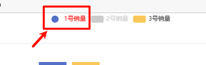

## legend 图列属性

## 概述

+ 图例组件

+ ECharts 3 中单个 echarts 实例中可以存在多个图例组件，会方便多个图例的布局

  

+ 与 series 是一一对应的

  

+ 文档 https://echarts.apache.org/zh/option.html#legend

## 所有属性

+ type图例的类型。可选值：

  + 'plain'：普通图例。 默认值
  + 'scroll'：可滚动翻页的图例。当图例数量较多时可以使用

+ id
+ show
+ zlevel
+ z
+ left
+ top
+ right
+ bottom
+ width
+ height
+ orient 图例列表的布局朝向

  + 'horizontal' 横向 默认值
  + 'vertical' 竖向

+ align
+ padding
+ itemGap `number`

  + 图例每项之间的间隔
  + 横向布局时为水平间隔，纵向布局时为纵向间隔
  + 默认为10

+ itemWidth `number`

  + 图例标记的图形宽度
  + 默认为25
    

+ itemHeight

  + 图例标记的图形高度
  + 默认为 14

+ itemStyle `Object`
+ lineStyle `Object`
+ symbolRotate
+ formatter `string | Function` 用来格式化图例文本，支持字符串模板和回调函数两种形式

  ```js
  // 使用字符串模板，模板变量为图例名称 {name}
  formatter: 'Legend {name}'

  // 使用回调函数
  formatter: function (name) {
    return 'Legend ' + name;
  }
  ```

+ selectedMode `string | boolean`

  + 图例选择的模式，控制是否可以通过点击图例改变系列的显示状态
  + 默认开启(`true`)图例选择，可以设成 `false` 关闭

  + 除此之外也可以设成

    + 'single' 单选模式
    + 'multiple' 多选模式 默认

+ inactiveColor 图例关闭时的颜色
+ inactiveBorderColor 图例关闭时的描边颜色
+ inactiveBorderWidth

+ selected 图例选中状态表(默认选中的状态)

  + 默认都为 `true`

  ```js
  selected: {
    // 选中'系列1'
    '系列1': true,
    // 不选中'系列2'
    '系列2': false
  }
  ```

    

+ textStyle `Object`

+ tooltip `Object`

  + 建议在全局中设置，不要在此设置
  + 默认不显示
  + 可以在 legend 文字很多的时候对文字做裁剪并且开启 tooltip

+ icon `string` 图例项的 icon

+ data `Array` 详见下面

+ backgroundColor
+ borderColor
+ borderWidth
+ borderRadius
+ shadowBlur
+ shadowColor
+ shadowOffsetX
+ shadowOffsetY

+ ... 详见下面

+ emphasis
+ selector
+ selectorLabel
+ selectorPosition
+ selectorItemGap
+ selectorButtonGap

## legend 之 data

+ `Array`

+ 图例的数据数组

  ```js
  myChart.setOption({
    // 图例
    legend: {
      data: ["1号销量", "2号销量", "3号销量"],
    },

    // 系列列表
    series: [
      {
        name: "1号销量",
        type: "bar", // 图标的类型
        data: [5, 20, 36, 10, 10, 20], // 图标的数据
      },
      {
        name: "2号销量",
        type: "bar", // 图标的类型
        data: [5, 20, 36, 10, 10, 20], // 图标的数据
      },
      {
        name: "3号销量",
        type: "bar", // 图标的类型
        data: [5, 20, 36, 10, 10, 20], // 图标的数据
      },
    ],
  });
  ```

  

+ 数组项通常为一个字符串，每一项代表一个系列的 name（如果是饼图，也可以是饼图单个数据的 name）
+ 图例组件会自动根据对应系列的图形标记（symbol）来绘制自己的颜色和标记，特殊字符串 `''`（空字符串）或者 `'\n'`（换行字符串）用于图例的换行

+ 如果 data 没有被指定，会自动从当前系列中获取

  + 多数系列会取自 series.name 或者 series.encode 的 seriesName 所指定的维度
  + 如 饼图 and 漏斗图 等会取自 series.data 中的 name

+ 如果要设置单独一项的样式，也可以把该项写成配置项对象。此时必须使用 name 属性对应表示系列的 name

  ```js
  legend: {

    data: [{
      name: '系列1',

      // 强制设置图形为圆
      icon: 'circle',

      // 设置文本为红色
      textStyle: {
        color: 'red'
      }
    }]
  }
  ```

    

+ 属性

  + name
  + icon 图例项的 icon
  + itemStyle
  + lineStyle
  + symbolRotate
  + inactiveColor
  + inactiveBorderColor
  + inactiveBorderWidth
  + textStyle

## 当 type = scroll 时的配置

+ 以下 设置是 `legend.type` 为 `scroll` 时有效

  + scrollDataIndex
  + pageButtonItemGap
  + pageButtonGap
  + pageButtonPosition
  + pageFormatter
  + pageIcons
  + pageIconColor
  + pageIconInactiveColor
  + pageIconSize
  + pageTextStyle
  + animation
  + animationDurationUpdate
