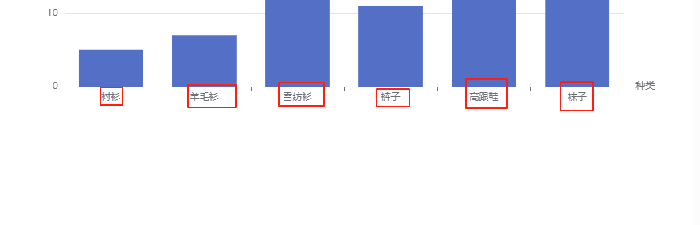
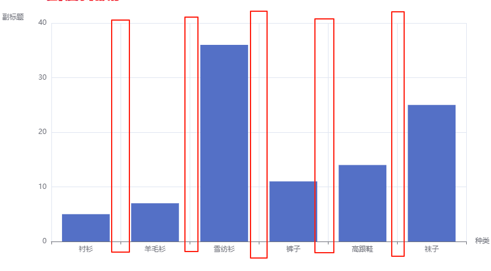
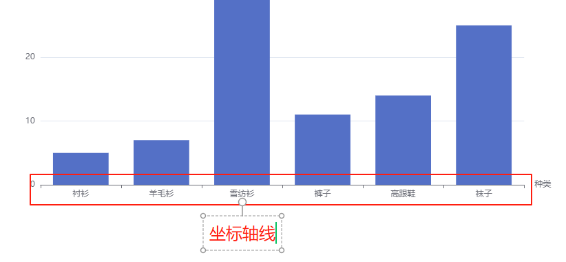
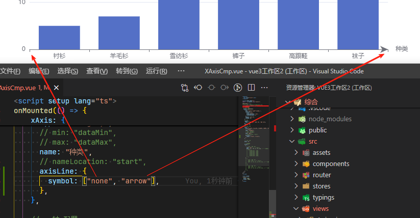
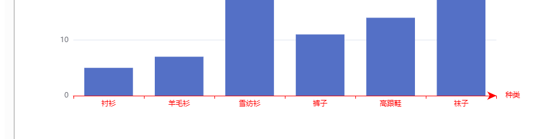
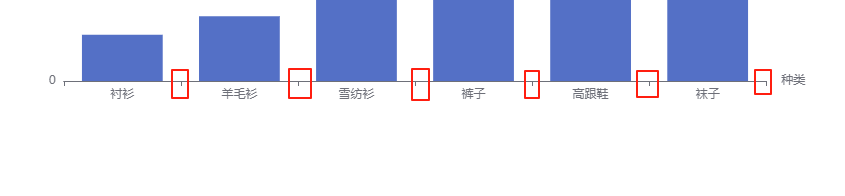
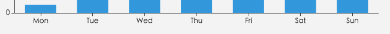

# X 轴

## 概述

+ 直角坐标系 grid 中的 x 轴，一般情况下单个 grid 组件最多只能放上下两个 x 轴，多于两个 x 轴需要通过配置 offset 属性防止同个位置多个 x 轴的重叠

## 属性

+ id
+ show 默认 `true`

+ gridIndex  详见下面

+ alignTicks

  + 在多个 x 轴为数值轴的时候，可以开启该配置项自动对齐刻度
  + 只对'value'和'log'类型的轴有效

+ position

  + x 轴的位置
  + 可选：

    + 'top'
    + 'bottom' 默认值

  + 默认 grid 中的第一个 x 轴在 grid 的下方（'bottom'），第二个 x 轴视第一个 x 轴的位置放在另一侧
  + 注：若未将 xAxis.axisLine.onZero 设为 false , 则该项无法生效

+ offset `number` 默认0

  + X 轴相对于默认位置的偏移，在相同的 position 上有多个 X 轴的时候有用
  + 注：若未将 xAxis.axisLine.onZero 设为 false , 则该项无法生效

+ type 详见下面

+ name

  + 坐标轴名称

  

+ nameLocation

  + 坐标轴名称显示位置

  + 可选：

    + 'start'
    + 'middle' 或者 'center'
    + 'end' `默认值`

  

+ nameTextStyle
+ nameGap 坐标轴名称与轴线之间的距离

  

+ nameRotate 坐标轴名字旋转，角度值
+ nameTruncate
+ inverse
+ boundaryGap
+ min `number | string | Function`

  + 坐标轴刻度最小值
  + 不设置时会自动计算最小值保证坐标轴刻度的均匀分布。

  + 在类目轴中，也可以设置为类目的序数（如类目轴 `data: ['类A', '类B', '类C']` 中，序数 2 表示 '类C'。也可以设置为负数，如 -3）

  + 类型

    + `number`
    + `string` 只有一个固定值 `'dataMin'` 此时取数据在该轴上的最小值作为最小刻度

      

    + `Function` 可以根据计算得出的数据最大最小值设定坐标轴的最小值。这个函数可返回坐标轴的最小值，也可返回 `null` / `undefined` 来表示“自动计算最小值”（返回 null/undefined 从 v4.8.0 开始支持）

      ```js
      // alue 是一个包含 min 和 max 的对象，分别表示数据的最大最小值
      min: function (value) {
        return value.min - 20;
      }
      ```

+ max

  + 坐标轴刻度最大值

+ scale 默认 `false`

  + 只在数值轴中（type: 'value'）有效
  + 是否是脱离 0 值比例
  + 设置成 true 后坐标刻度不会强制包含零刻度。在双数值轴的散点图中比较有用
  + 在设置 min 和 max 之后该配置项无效

+ splitNumber 默认 `5`

  + 坐标轴的分割段数，需要注意的是这个分割段数只是个预估值，最后实际显示的段数会在这个基础上根据分割后坐标轴刻度显示的易读程度作调整

  + 在类目轴中无效

+ minInterval

  + 自动计算的坐标轴最小间隔大小

  + 例如可以设置成1保证坐标轴分割刻度显示成整数

+ maxInterval

  + 自动计算的坐标轴最大间隔大小

+ interval

  + 强制设置坐标轴分割间隔

  + 因为 splitNumber 是预估的值，实际根据策略计算出来的刻度可能无法达到想要的效果，这时候可以使用 interval 配合 min、max 强制设定刻度划分，**一般不建议使用**

  + 无法在类目轴中使用。在时间轴（type: 'time'）中需要传时间戳，在对数轴（type: 'log'）中需要传指数值

+ logBase
+ startValue
+ silent
+ triggerEvent
+ axisLine 坐标轴轴线相关设置 详见下面
+ axisTick 坐标轴刻度相关设置 详见下面
+ minorTick
+ axisLabel 坐标轴刻度标签的相关设置

  

+ splitLine 坐标轴在 grid 区域中的分隔线

  

+ minorSplitLine
+ splitArea
+ data `Array` 详见下面

+ axisPointer
+ tooltip
+ animation
+ animationThreshold
+ animationDuration
+ animationEasing
+ animationDelay
+ animationDurationUpdate
+ animationEasingUpdate
+ animationDelayUpdate
+ zlevel
+ z

## xAxis 之 gridIndex

+ gridIndex `number` x 轴所在的 grid 的索引，默认位于第一个 grid

  + 在多个坐标系中才用用处
  + 默认值 0

  ```js
  grid: [
    { left: '7%', top: '7%', width: '38%', height: '38%' },
    { right: '7%', top: '7%', width: '38%', height: '38%' },
    { left: '7%', bottom: '7%', width: '38%', height: '38%' },
    { right: '7%', bottom: '7%', width: '38%', height: '38%' }
  ],
  xAxis: [
    { gridIndex: 0, min: 0, max: 20 },
    { gridIndex: 1, min: 0, max: 20 },
    { gridIndex: 2, min: 0, max: 20 },
    { gridIndex: 3, min: 0, max: 20 }
  ],
  ```

  

## xAxis 之 type

+ 坐标轴类型

+ 默认值 `category`

+ 可选：

  + 'value' 数值轴，适用于连续数据

    

    + 要求 serie的data里面的数据都要是数字，如果是非数字，则不显示

      ```js
      series: [
        {
          name: "1号销量",
          type: "bar", // 图标的类型
          data: [5, 20, 36, 10, 10, 20], // 图标的数据
        }
      ],
      ```

      

  + 'category' 类目轴，适用于离散的类目数据。为该类型时类目数据可自动从 series.data 或 dataset.source 中取，或者可通过 xAxis.data 设置类目数据

    

    ```js
    // x 轴 配置
    xAxis: {
      data: ["衬衫", "羊毛衫", "雪纺衫", "裤子", "高跟鞋", "袜子"],
      type: "category",
    },

    // 系列列表
    series: [
      {
        // name: "1号销量",
        type: "bar", // 图标的类型
        data: [5, 7, 36, 11, 14, 25], // 图标的数据
      },
    ]
    ```

      


  + 'time' 时间轴，适用于连续的时序数据，与数值轴相比时间轴带有时间的格式化，在刻度计算上也有所不同，例如会根据跨度的范围来决定使用月，星期，日还是小时范围的刻度

    ```js
    // x 轴 配置
    xAxis: {
      // data: ["衬衫", "羊毛衫", "雪纺衫", "裤子", "高跟鞋", "袜子"],
      type: "time",
    },
    series: [
      {
        type: "bar", // 图标的类型

        // 数据格式
        data: [
          ["1997/10/1", 199],
          ["1997/10/2", 299],
          ["1997/10/3", 399],
          ["1997/10/4", 499],
          ["1997/10/5", 599],
          ["1997/10/6", 699],
        ],
      },
    ],
    ```

  + 'log' 对数轴。适用于对数数据。对数轴下的堆积柱状图或堆积折线图可能带来很大的视觉误差，并且在一定情况下可能存在非预期效果，应避免使用

## xAxis 之 axisLine

+ 坐标轴轴线相关设置 `Object`

  

+ 属性

+ show 默认 `true`
+ onZero `true`

  + X 轴或者 Y 轴的轴线是否在另一个轴的 0 刻度上，只有在另一个轴为数值轴且包含 0 刻度时有效

+ onZeroAxisIndex
+ symbol `string | Array` 默认 `'none'`

  + 轴线两边的箭头。可以是字符串，表示两端使用同样的箭头；或者长度为 2 的字符串数组，分别表示两端的箭头
  + 默认不显示箭头，即 `'none'`
  + 两端都显示箭头可以设置为 'arrow'，只在末端显示箭头可以设置为 `['none', 'arrow']`

  

+ symbolSize `Array` `[10, 15]`

  + 轴线两边的箭头的大小，第一个数字表示宽度（垂直坐标轴方向），第二个数字表示高度（平行坐标轴方向）

+ symbolOffset `Array | number`

  + 轴线两边的箭头的偏移，如果是数组，第一个数字表示起始箭头的偏移，第二个数字表示末端箭头的偏移；
  + 如果是数字，表示这两个箭头使用同样的偏移

+ lineStyle `Object`

  + color 坐标轴线线的颜色

    ```js
    xAxis: {
      data: ["衬衫", "羊毛衫", "雪纺衫", "裤子", "高跟鞋", "袜子"],
      type: "category",
      axisLine: {
        lineStyle: {
          color: "red",
        },
      },
    },
    ```

      

  + width
  + type
  + dashOffset
  + cap
  + join
  + miterLimit
  + shadowBlur
  + shadowColor
  + shadowOffsetX
  + shadowOffsetY
  + opacity

## Axis 之 axisTick

+ 坐标轴刻度相关设置

  

+ 属性

+ show
+ alignWithLabel `boolean`

  + 默认值 `false`
  + 类目轴中在 boundaryGap 为 true 的时候有效，可以保证刻度线和标签对齐

    

+ interval
+ inside
+ length
+ lineStyle
+ customValues

## Axis 之 data

+ `Array`

+ 类目数据，在类目轴（type: 'category'）中有效

+ 如果没有设置 type，但是设置了 axis.data，则认为 type 是 'category'

+ 如果设置了 type 是 'category'，但没有设置 axis.data，则 axis.data 的内容会自动从 series.data 中获取，这会比较方便。不过注意，axis.data 指明的是 'category' 轴的取值范围。如果不指定而是从 series.data 中获取，那么只能获取到 series.data 中出现的值。比如说，假如 series.data 为空时，就什么也获取不到

  ```js
  // 所有类目名称列表
  data: ['周一', '周二', '周三', '周四', '周五', '周六', '周日']

  // 每一项也可以是具体的配置项，此时取配置项中的 `value` 为类目名
  data: [{
      value: '周一',
      // 突出周一
      textStyle: {
          fontSize: 20,
          color: 'red'
      }
  }, '周二', '周三', '周四', '周五', '周六', '周日']
  ```