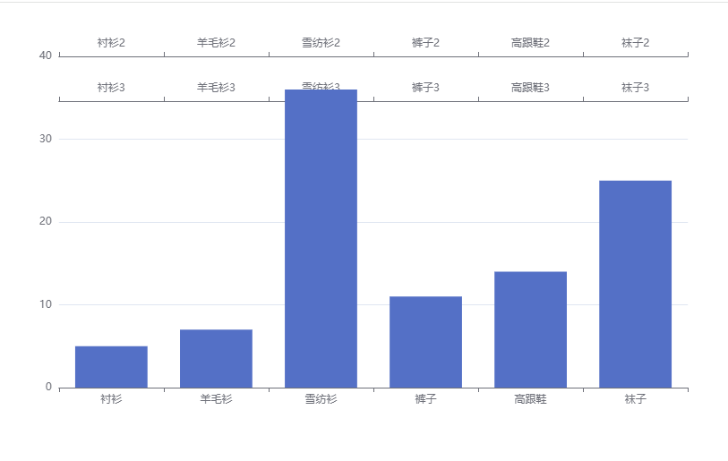

# 多坐标轴

## code

+ code

  ```js
  // x 轴 配置
  xAxis: [
    {
      data: ["衬衫", "羊毛衫", "雪纺衫", "裤子", "高跟鞋", "袜子"],
    },
    {
      data: ["衬衫2", "羊毛衫2", "雪纺衫2", "裤子2", "高跟鞋2", "袜子2"],
    },
    {
      data: ["衬衫3", "羊毛衫3", "雪纺衫3", "裤子3", "高跟鞋3", "袜子3"],
      offset: -50,
    },
  ],
  series: [
  {
    // name: "1号销量",
    type: "bar", // 图标的类型
    data: [5, 7, 36, 11, 14, 25], // 图标的数据
  },]
  ```

  
