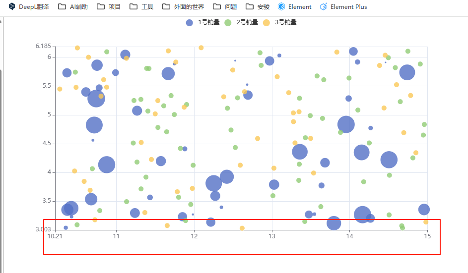

## 类型 inside 内置型

## 概述

+ 内置型数据区域缩放组件（dataZoomInside）

+ 所谓『内置』，即内置在坐标系中

  + 平移：在坐标系中滑动拖拽进行数据区域平移。

  + 缩放：

    + PC端：鼠标在坐标系范围内滚轮滚动（MAC触控板类同）
    + 移动端：在移动端触屏上，支持两指滑动缩放。

## 概述

+ type: 'inside'
+ id
+ disabled `boolean`

  + 默认 `false`
  + 是否停止组件的功能

+ xAxisIndex `number | Array`

  + 设置 dataZoom-inside 组件控制的 x轴（即xAxis，是直角坐标系中的概念，参见 grid）

  + 不指定时，当 dataZoom-inside.orient 为 'horizontal'时，默认控制和 dataZoom 平行的第一个 xAxis

    + 但是不建议使用默认值，建议显式指定

  + 如果是 number 表示控制一个轴，如果是 Array 表示控制多个轴

  


  ```js
  option: {
    xAxis: [
      {...}, // 第一个 xAxis
      {...}, // 第二个 xAxis
      {...}, // 第三个 xAxis
      {...}  // 第四个 xAxis
    ],
    dataZoom: [
      { // 第一个 dataZoom 组件
        xAxisIndex: [0, 2] // 表示这个 dataZoom 组件控制 第一个 和 第三个 xAxis
      },
      { // 第二个 dataZoom 组件
        xAxisIndex: 3      // 表示这个 dataZoom 组件控制 第四个 xAxis
      }
    ]
  }
  ```

+ yAxisIndex
+ radiusAxisIndex
+ angleAxisIndex
+ filterMode 详见下面
+ satart

  + 数据窗口范围的起始百分比。范围是：0 ~ 100
  + 表示 0% ~ 100%。

+ end

  + 数据窗口范围的结束百分比。范围是：0 ~ 100。

  + dataZoom-inside.start 和 dataZoom-inside.end 共同用 百分比 的形式定义了数据窗口范围

+ startValue
+ endValue
+ minSpan
+ maxSpan
+ minValueSpan
+ maxValueSpan
+ orient

  + 布局方式是横还是竖。不仅是布局方式，对于直角坐标系而言，也决定了，缺省情况控制横向数轴还是纵向数轴。

  + 可选值为

    + 'horizontal'：水平
    + 'vertical'：竖直

+ zoomLock

  + 是否锁定选择区域（或叫做数据窗口）的大小。
  + 如果设置为 true 则锁定选择区域的大小，也就是说，只能平移，不能缩放。

+ throttle

  + 设置触发视图刷新的频率。单位为毫秒（ms）
  + 如果 animation 设为 true 且 animationDurationUpdate 大于 0，可以保持 throttle 为默认值 100（或者设置为大于 0 的值），否则拖拽时有可能画面感觉卡顿

  + 如果 animation 设为 false 或者 animationDurationUpdate 设为 0，且在数据量不大时，拖拽时画面感觉卡顿，可以把尝试把 throttle 设为 0 来改善

+ rangeMode 详见下面
+ zoomOnMouseWheel `boolean | string`

  + 如何触发缩放 `true` 默认值
  + 可选值为：

    + true：表示不按任何功能键，鼠标滚轮能触发缩放
    + false：表示鼠标滚轮不能触发缩放
    + 'shift'：表示按住 shift 和鼠标滚轮能触发缩放
    + 'ctrl'：表示按住 ctrl 和鼠标滚轮能触发缩放
    + 'alt'：表示按住 alt 和鼠标滚轮能触发缩放

+ moveOnMouseMove `boolean | string`

  + 如何触发数据窗口平移 `true` 默认值
  + 可选值为：

    + true：表示不按任何功能键，鼠标移动能触发数据窗口平移
    + false：表示鼠标移动不能触发平移
    + 'shift'：表示按住 shift 和鼠标移动能触发数据窗口平移
    + 'ctrl'：表示按住 ctrl 和鼠标移动能触发数据窗口平移
    + 'alt'：表示按住 alt 和鼠标移动能触发数据窗口平移

+ moveOnMouseWheel `boolean | string`

  + 如何触发数据窗口平移 `true` 默认值

    + true：表示不按任何功能键，鼠标滚轮能触发数据窗口平移
    + false：表示鼠标滚轮不能触发平移
    + 'shift'：表示按住 shift 和鼠标滚轮能触发数据窗口平移
    + 'ctrl'：表示按住 ctrl 和鼠标滚轮能触发数据窗口平移
    + 'alt'：表示按住 alt 和鼠标滚轮能触发数据窗口平移

+ preventDefaultMouseMove `boolean`

  + 是否阻止 mousemove 事件的默认行为 `true` 默认值

### 之 filterMode

+ dataZoom 的运行原理是通过 数据过滤 以及在内部设置轴的显示窗口来达到 数据窗口缩放 的效果

+ 数据过滤模式（dataZoom.filterMode）的设置不同，效果也不同。

+ 可选值为：

  + 'filter'：当前数据窗口外的数据，被 过滤掉。即 会 影响其他轴的数据范围。每个数据项，只要有一个维度在数据窗口外，整个数据项就会被过滤掉 **默认值**

  + 'weakFilter'：当前数据窗口外的数据，被 过滤掉。即 会 影响其他轴的数据范围。每个数据项，只有当全部维度都在数据窗口同侧外部，整个数据项才会被过滤掉

  + 'empty'：当前数据窗口外的数据，被 设置为空。即 不会 影响其他轴的数据范围

  + 'none': 不过滤数据，只改变数轴范围

+ 如何设置，由用户根据场景和需求自己决定。经验来说：

  + 当『只有 X 轴 或 只有 Y 轴受 dataZoom 组件控制』时，常使用 `filterMode: 'filter'` ，这样能使另一个轴自适应过滤后的数值范围

  + 当『X 轴 Y 轴分别受 dataZoom 组件控制』时：

    + 如果 X 轴和 Y 轴是『同等地位的、不应互相影响的』，比如在『双数值轴散点图』中，那么两个轴可都设为 `filterMode: 'empty'`

    + 如果 X 轴为主，Y 轴为辅，比如在『柱状图』中，需要『拖动 dataZoomX 改变 X 轴过滤柱子时，Y 轴的范围也自适应剩余柱子的高度』，『拖动 dataZoomY 改变 Y 轴过滤柱子时，X 轴范围不受影响』，那么就 X轴设为 `filterMode: 'filter'` ，Y 轴设为 `filterMode: 'empty'` ，即主轴 'filter'，辅轴 'empty'


    ```js
    option = {
      dataZoom: [
        {
          id: 'dataZoomX',
          type: 'slider',
          xAxisIndex: [0],
          filterMode: 'filter'
        },
        {
          id: 'dataZoomY',
          type: 'slider',
          yAxisIndex: [0],
          filterMode: 'empty'
        }
      ],
      xAxis: {type: 'value'},
      yAxis: {type: 'value'},
      series{
        type: 'bar',
        data: [
          // 第一列对应 X 轴，第二列对应 Y 轴。
          [12, 24, 36],
          [90, 80, 70],
          [3, 9, 27],
          [1, 11, 111]
        ]
      }
    }
    ```

## 之 rangeMode

+ `Array`

+ 形式为：[rangeModeForStart, rangeModeForEnd]。

  + 例如 rangeMode: ['value', 'percent']，表示 start 值取绝对数值，end 取百分比。

+ 每项可选值为：'value', 'percent'

  + 'value' 模式：处于此模式下，坐标轴范围（axis extent）总只会被dataZoom.startValue and dataZoom.endValue 决定，而不管数据是多少，以及不管，axis.min 和 axis.max 怎么设置。

  + 'percent' 模式：处于此模式下，100 代表 100% 的 `[dMin, dMax]`。这里 dMin 表示，如果 axis.min 设置了就是 axis.min，否则是 data.extent[0]；dMax 表示，如果 axis.max 设置了就是 axis.max，否则是 data.extent[1]。[dMin, dMax] 乘以 percent 的结果得到坐标轴范围（axis extent）。

+ 默认情况下，rangeMode 总是被自动设定。如果指定了 option.start/option.end 那么就设定为 'percent'，如果指定了 option.startValue/option.endValue 那么就设定为 'value'。以及当用户用不用操作触发视图改变时，rangeMode 也可能会相应得变化（如，通过 toolbox.dataZoom 触发视图改变时，rangeMode 会自动被设置为 value，通过 dataZoom-inside 和 dataZoom-slider 触发视图改变时，会自动被设置为 'percent'）。

+ 如果我们手动在 option 中设定了 rangeMode，那么它只在 start 和 startValue 都设置了或者 end 和 endValue 都设置了才有意义。所以通常我们没必要在 option 中指定 rangeMode。

+ 举例一个使用场景：当我们使用动态数据时（即，周期性得通过 setOption 来改变数据），如果 rangeMode 在 'value' 模式，dataZoom 的窗口会一直保持在一个固定的值区间，无论数据怎么改变添加了多少；如果 rangeMode 在 'percent' 模式，窗口会随着数据的添加而改变（假设 axis.min 和 axis.max 没有被设置）。
