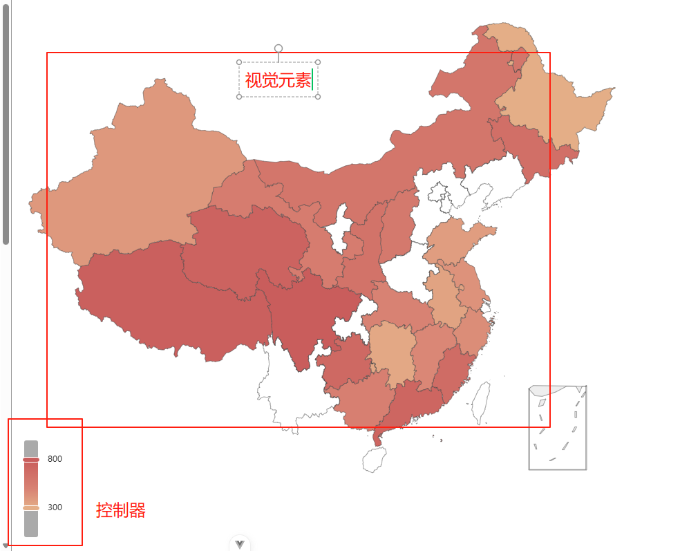

# visualMap

## 概述

+ visualMap 是视觉映射组件，用于进行『视觉编码』，也就是将数据映射到视觉元素（视觉通道）

  + 视觉映射组件：高亮某一部分数据的工具

+ visualMap 组件可以定义多个，从而可以同时对数据中的多个维度进行视觉映射

## 组成

+ 视觉元素
+ 控制器

  

## 分类

+ visualMap 组件可以定义为 分段型（visualMapPiecewise） 或 连续型（visualMapContinuous），通过 type 来区分

  ```js
  option = {
    visualMap: [
      // 第一个 visualMap 组件
      {
        type: 'continuous', // 定义为连续型 visualMap
        ...
      },

      // 第二个 visualMap 组件
      {
        type: 'piecewise', // 定义为分段型 visualMap
        ...
      }
    ],
    ...
  };
  ```
