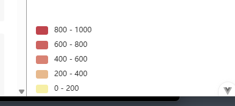
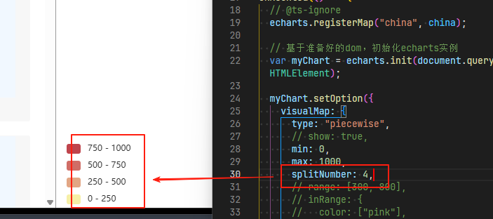
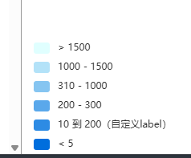

# piecewise 分段型视觉映射组件

## 概述

+ 分段型视觉映射组件（visualMapPiecewise）

  

## 分段型视觉映射组件模式

+ 分段型视觉映射组件，有三种模式：

+ 连续型数据平均分段: 依据 visualMap-piecewise.splitNumber 来自动平均分割成若干块

  ```js
  visualMap: {
    type: "piecewise",
    // show: true,
    min: 0,
    max: 1000,
    splitNumber: 4
  },
  ```

+ 连续型数据自定义分段: 依据 visualMap-piecewise.pieces 来定义每块范围
+ 离散数据根据类别分段: 类别定义在 visualMap-piecewise.categories 中

## 属性

+ type

  + `piecewise`

+ id
+ splitNumber `number`

  + 对于连续型数据，自动平均切分成几段
  + 默认为5段
  + 连续数据的范围需要 `max` 和 `min` 来指定

    ```js
    visualMap: {
      type: "piecewise",
      min: 0,
      max: 1000,
      splitNumber: 4,
    },
    ```

    

+ pieces 详见下面
+ categories
+ min
+ max
+ minOpen `boolean`

  + 当 type 为 piecewise 且使用 min/max/splitNumber 时，此参数有效
  + 当值为 true 时，界面上会额外多出一个『< min』的选块

+ maxOpen
+ selectedMode
+ inverse
+ precision
+ itemWidth
+ itemHeight
+ align
+ text
+ textGap
+ showLabel
+ itemGap
+ itemSymbol
+ show
+ dimension
+ seriesIndex
+ seriesId
+ hoverLink
+ inRange
+ outOfRange

## pieces 连续型数据自定义分段

+ 自定义『分段式视觉映射组件（visualMapPiecewise）』的每一段的范围，以及每一段的文字，以及每一段的特别的样式

  ```js
  pieces: [
    {min: 1500}, // 不指定 max，表示 max 为无限大（Infinity）
    {min: 900, max: 1500},
    {min: 310, max: 1000},
    {min: 200, max: 300},
    {min: 10, max: 200, label: '10 到 200（自定义label）'},
    {value: 123, label: '123（自定义特殊颜色）', color: 'grey'}, // 表示 value 等于 123 的情况
    {max: 5}     // 不指定 min，表示 min 为无限大（-Infinity）
  ]
  ```

  

+ 或者，更精确得，可以使用 `lt` （小于，less than）， `gt` （大于，greater than）， `lte` （小于等于 less than or equals）， `gte` （大于等于，greater than or equals）来表达边界

  ```js
  visualMap: {
    pieces: [
      {gt: 1500},            // (1500, Infinity]
      {gt: 900, lte: 1500},  // (900, 1500]
      {gt: 310, lte: 1000},  // (310, 1000]
      {gt: 200, lte: 300},   // (200, 300]
      {gt: 10, lte: 200, label: '10 到 200（自定义label）'},       // (10, 200]
      {value: 123, label: '123（自定义特殊颜色）', color: 'grey'},  // [123, 123]
      {lt: 5}                 // (-Infinity, 5)
    ]
  }
  ```

+ 注意，如果两个 piece 的区间重叠，则会自动进行去重

+ 在每个 piece 中支持的 visualMap 属性有：

  + symbol: 图元的图形类别
  + symbolSize: 图元的大小
  + color: 图元的颜色
  + colorAlpha: 图元的颜色的透明度
  + opacity: 图元以及其附属物（如文字标签）的透明度
  + colorLightness: 颜色的明暗度，参见 HSL
  + colorSaturation: 颜色的饱和度，参见 HSL
  + colorHue: 颜色的色调，参见 HSL

