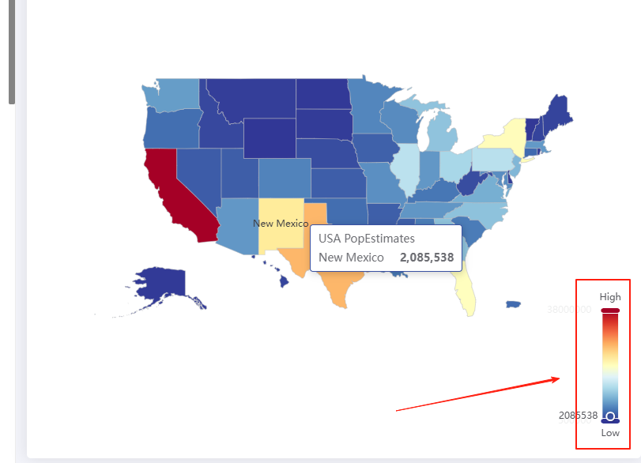
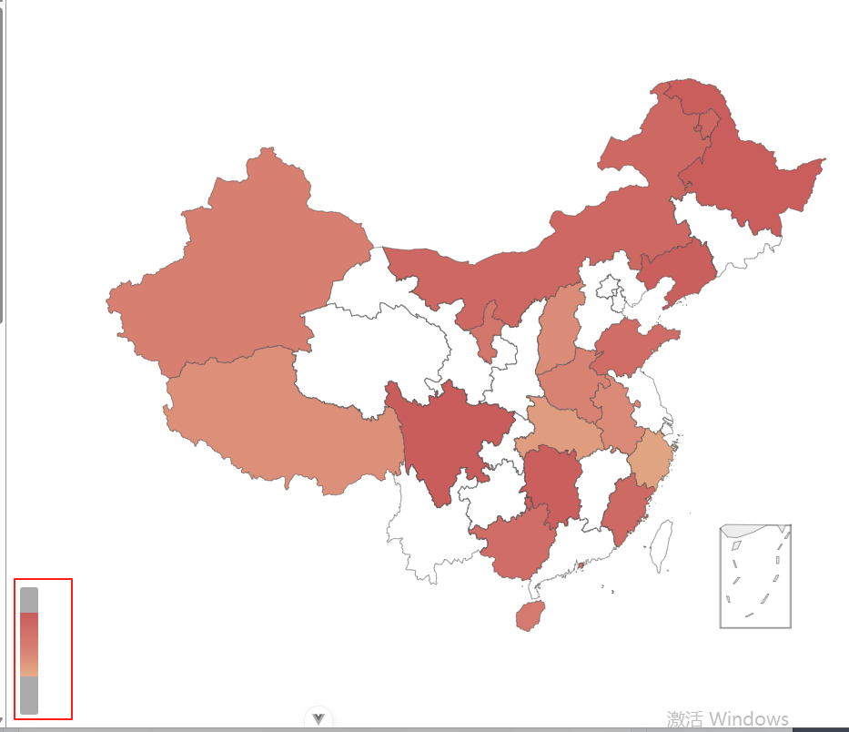
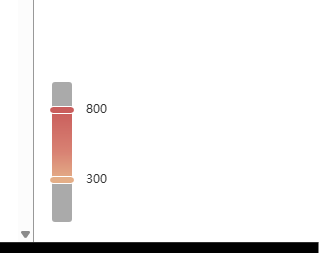
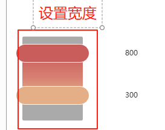
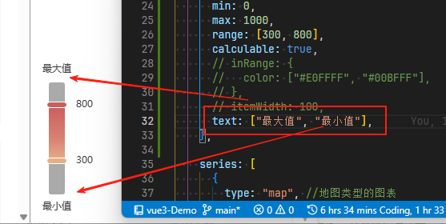
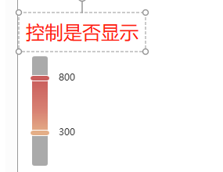

# continuous 连续型视觉映射组件

## 概述

+ visualMapContinuous中，可以通过 visualMap.calculable 来显示或隐藏手柄（手柄能拖拽改变值域）

  

## 属性

+ type

  + `continuous`  类型为连续型

+ id
+ min `number`

  + 指定 visualMapContinuous 组件的允许的最小值
  + 'min' 必须用户指定
  + `[visualMap.min, visualMax.max]` 形成了视觉映射的『定义域』

+ max

  + 指定 visualMapContinuous 组件的允许的最大值
  + 'max' 必须用户指定
  + `[visualMap.min, visualMax.max]` 形成了视觉映射的『定义域』

+ range `Array`

  + 指定手柄对应数值的位置
  + range 应在 min max 范围内
  + 不设置 range，则 range 默认为 `[min, max]`

    ```js
    chart.setOption({
      visualMap: {
        min: 0,
        max: 100,
        // 两个手柄对应的数值是 4 和 15
        range: [4, 15],
        ...
      }
    });
    ```

    

+ unboundedRange `boolean`

  + 当 range 等于或超出 min 或 max 时，是否视为范围无限

+ calculable `boolean`

  + 默认 `false`
  + 是否显示拖拽用的手柄

    

+ realtime `boolean`

  + 拖拽时，是否实时更新

    + 如果为 `true` 则拖拽手柄过程中实时更新图表视图 *默认值*

    + 如果为 `false` 则拖拽结束时，才更新视图

+ inverse `boolean`

  + 是否反转 visualMap 组件
  + 默认值 `false`

  + 当inverse为 `false` 时，数据大小的位置规则，和直角坐标系相同，即：

    + 当 visualMap.orient 为'vertical'时，数据上大下小。
    + 当 visualMap.orient 为'horizontal'时，数据右大左小。

  + 当inverse为true时，相反

+ precision `number`

  + 数据展示的小数精度
  + 默认为0，无小数点

+ itemWidth `number`

  + 默认 20
  + 图形的宽度，即长条的宽度

    

+ itemHeight `number`

  + 默认 `140`
  + 图形的高度，即长条的高度

+ align

  + 指定组件中手柄和文字的摆放位置，可选值为：

    + 'auto' 自动决定
    + 'left' 手柄和label在右，orient 为 horizontal 时有效
    + 'right' 手柄和label在左，orient 为 horizontal 时有效
    + 'top' 手柄和label在下，orient 为 vertical 时有效
    + 'bottom' 手柄和label在上，orient 为 vertical 时有效

+ text

  + 两端的文本，如 `['High', 'Low']`

    

+ textGap `number`

  + 默认值 10
  + 两端文字主体之间的距离，单位为px

+ show `boolean`

  + 默认值 `true`
  + 是否显示 控制器 组件
  + 如果设置为 `false` 不会显示，但是数据映射的功能还存在

    

+ dimension `number`

  + 指定用数据的『哪个维度』，映射到视觉元素上。『数据』即 series.data。 可以把 series.data 理解成一个二维数组

    ```js
    [
      [12, 23, 43],
      [12, 23, 43],
      [43, 545, 65],
      [92, 23, 33]
    ]
    ```

+ seriesIndex
+ seriesId
+ hoverLink
+ inRange
+ outOfRange
+ controller
+ zlevel
+ z
+ left
+ top
+ right
+ bottom
+ coordinateSystem
+ coordinateSystemUsage
+ coord
+ calendarIndex
+ calendarId
+ matrixIndex
+ matrixId
+ orient
+ padding
+ backgroundColor
+ borderColor
+ borderWidth
+ color
+ textStyle
+ formatter
+ handleIcon
+ handleSize
+ handleStyle
+ indicatorIcon
+ indicatorSize
+ indicatorStyle
