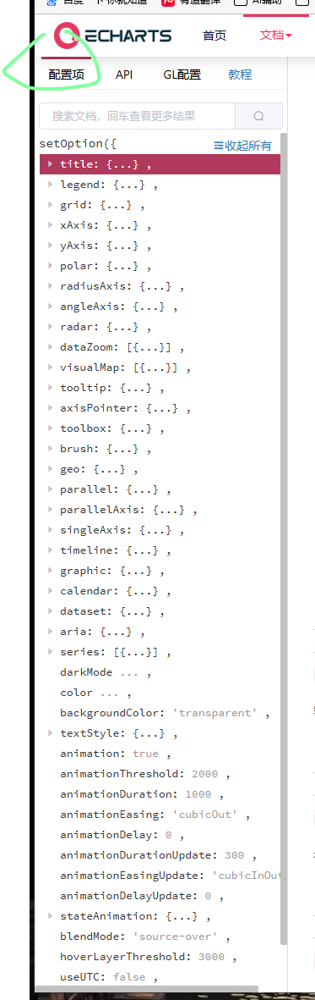
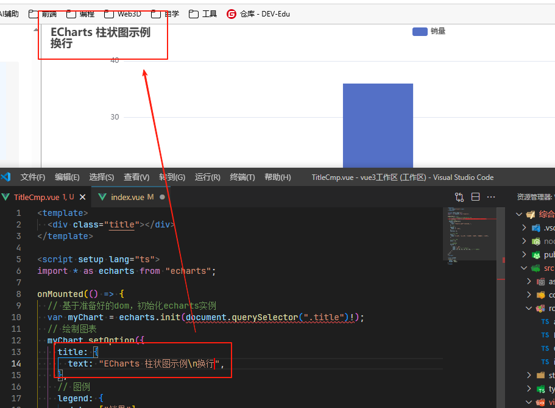

# 属性

## 概述

+ 所有属性

  

## title属性

+ 标题组件，包含主标题和副标题

  ```js
  // 基于准备好的dom，初始化echarts实例
  var myChart = echarts.init(document.querySelector(".title")!);
  // 绘制图表
  myChart.setOption({
    title: {
      id:"",
      text: "ECharts 柱状图示例",
    },

    // y 轴 配置
    yAxis: {},

    // 系列列表
    series: [
     ....
    ],
  });
  ```

+ 属性

  + id `string` ： 组件 ID。默认不指定。指定则可用于在 option 或者 API 中引用组件
  + show `boolean` 是否显示标题组件。默认 `true`
  + title `string` 主标题文本，支持使用 `\n` 换行

    

  + link `string` 主标题文本超链接
