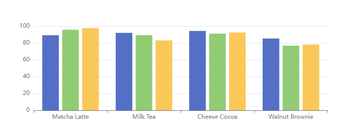
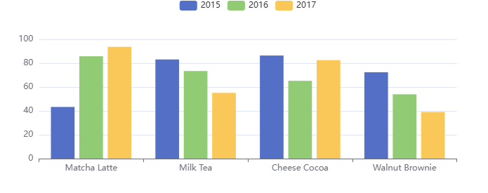

# 在系列与数据集中设置数据的区别

## 在系列中设置数据

+ 如果数据设置在 系列（series） 中，例如：

  ```js
  option = {
    xAxis: {
      type: 'category',
      data: ['Matcha Latte', 'Milk Tea', 'Cheese Cocoa', 'Walnut Brownie']
    },
    yAxis: {},
    series: [
      {
        type: 'bar',
        name: '2015',
        data: [89.3, 92.1, 94.4, 85.4]
      },
      {
        type: 'bar',
        name: '2016',
        data: [95.8, 89.4, 91.2, 76.9]
      },
      {
        type: 'bar',
        name: '2017',
        data: [97.7, 83.1, 92.5, 78.1]
      }
    ]
  };
  ```

    

+ 优点

  + 适于对一些特殊的数据结构（如“树”、“图”、超大数据）进行一定的数据类型定制

+ 缺点

  + 常需要用户先处理数据，把数据分割设置到各个系列（和类目轴）中。此外，不利于多个系列共享一份数据，也不利于基于原始数据进行图表类型、系列的映射安排

## 在数据集中设置数据

+ 而数据设置在 数据集（dataset） 中，会有这些好处：

  + 能够贴近数据可视化常见思维方式：（I）提供数据，（II）指定数据到视觉的映射，从而形成图表
  + 数据和其他配置可以被分离开来。数据常变，其他配置常不变。分开易于分别管理
  + 数据可以被多个系列或者组件复用，对于大数据量的场景，不必为每个系列创建一份数据
  + 支持更多的数据的常用格式，例如二维数组、对象数组等，一定程度上避免使用者为了数据格式而进行转换

  ```js
  option = {
    legend: {},
    tooltip: {},
    dataset: {
      // 提供一份数据。
      source: [
        ['product', '2015', '2016', '2017'],
        ['Matcha Latte', 43.3, 85.8, 93.7],
        ['Milk Tea', 83.1, 73.4, 55.1],
        ['Cheese Cocoa', 86.4, 65.2, 82.5],
        ['Walnut Brownie', 72.4, 53.9, 39.1]
      ]
    },
    // 声明一个 X 轴，类目轴（category）。默认情况下，类目轴对应到 dataset 第一列。
    xAxis: { type: 'category' },
    // 声明一个 Y 轴，数值轴。
    yAxis: {},
    // 声明多个 bar 系列，默认情况下，每个系列会自动对应到 dataset 的每一列。
    series: [{ type: 'bar' }, { type: 'bar' }, { type: 'bar' }]
  };
  ```

  

+ 或者也可以使用常见的“对象数组”的格式

  ```js
  option = {
    legend: {},
    tooltip: {},
    dataset: {
      // 用 dimensions 指定了维度的顺序。直角坐标系中，如果 X 轴 type 为 category，
      // 默认把第一个维度映射到 X 轴上，后面维度映射到 Y 轴上。
      // 如果不指定 dimensions，也可以通过指定 series.encode
      // 完成映射，参见后文。
      dimensions: ['product', '2015', '2016', '2017'],
      source: [
        { product: 'Matcha Latte', '2015': 43.3, '2016': 85.8, '2017': 93.7 },
        { product: 'Milk Tea', '2015': 83.1, '2016': 73.4, '2017': 55.1 },
        { product: 'Cheese Cocoa', '2015': 86.4, '2016': 65.2, '2017': 82.5 },
        { product: 'Walnut Brownie', '2015': 72.4, '2016': 53.9, '2017': 39.1 }
      ]
    },
    xAxis: { type: 'category' },
    yAxis: {},
    series: [{ type: 'bar' }, { type: 'bar' }, { type: 'bar' }]
  };
  ```
