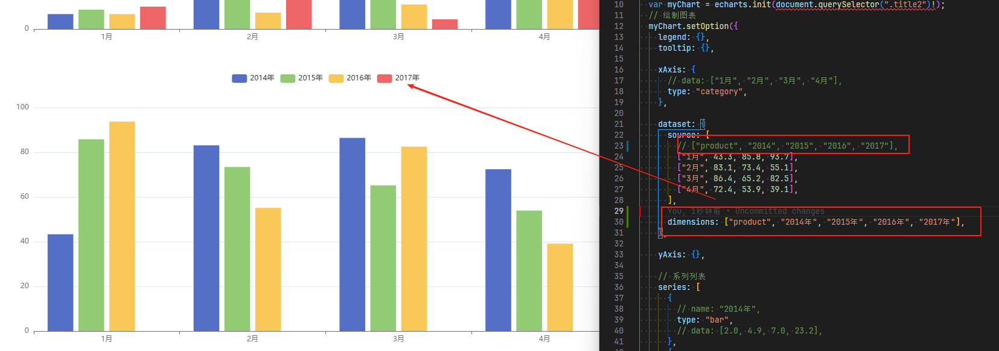
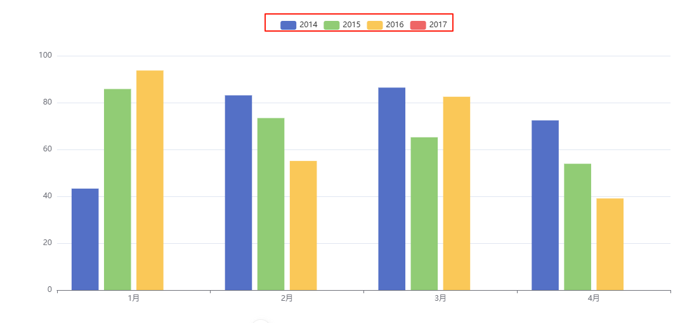

# 属性

## 所有属性

+ id
+ source 详见下面
+ dimensions `Array`

  + 使用 dimensions 定义 series.data 或者 dataset.source 的每个维度的信息

  + 注意：如果使用了 dataset，那么可以在 dataset.dimensions 中定义 dimension ，或者在 dataset.source 的第一行/列中给出 dimension 名称。于是就不用在这里指定 dimension。但如果在这里指定了 dimensions，那么优先使用这里的

    

    ```js
    option = {
      dataset: {
        source: [
          // 有了上面 dimensions 定义后，下面这五个维度的名称分别为：
          // 'date', 'open', 'close', 'highest', 'lowest'
          [12, 44, 55, 66, 2],
          [23, 6, 16, 23, 1],
          ...
        ]
      },
      series: {
        type: 'xxx',
        // 定义了每个维度的名称。这个名称会被显示到默认的 tooltip 中。
        dimensions: ['product', '2014', '2015', '2016']
      }
    }

    series: {
      type: 'xxx',
      dimensions: [
        null,                // 如果此维度不想给出定义，则使用 null 即可
        {type: 'ordinal'},   // 只定义此维度的类型。
                              // 'ordinal' 表示离散型，一般文本使用这种类型。
                              // 如果类型没有被定义，会自动猜测类型。
        {name: 'good', type: 'number'},
        'bad'                // 等同于 {name: 'bad'}
      ]
    }
    ```

  + type https://echarts.apache.org/handbook/zh/concepts/dataset/#%E7%BB%B4%E5%BA%A6%EF%BC%88dimension%EF%BC%89

    ```js
    dimensions: ['product', '2014', '2015', { name: '2016', type: "number" }]
    ```

+ sourceHeader `boolean | number`

  + dataset.source 第一行/列是否是 维度名 信息

  + 可选值：

    + null/undefined/'auto'：默认，自动探测
    + true：第一行/列是维度名信息
    + false：第一行/列直接开始是数据
    + number: 维度名行/列数，也就是数据行/列的开始索引

      + 例如：sourceHeader: 2 意味着前两行/列为维度名，从第三行/列开始为数据

  + 注意：“第一行/列” 的意思是，如果 series.seriesLayoutBy 设置为 'column'（默认值），则取第一行，如果 series.seriesLayoutBy 设置为 'row'，则取第一列

+ transform
+ fromDatasetIndex
+ fromDatasetId
+ fromTransformResult

## source

+ 原始数据 `Array | Object`

+ 一般来说，原始数据表达的是二维表

+ 可以用如下这些格式表达二维表：

  + 二维数组，其中第一行/列可以给出 维度名，也可以不给出，直接就是数据：

    ```js
    dataset: {
      source: [
        ["product", "2014", "2015", "2016", "2017"], // 维度名称
        ["1月", 43.3, 85.8, 93.7],
        ["2月", 83.1, 73.4, 55.1],
        ["3月", 86.4, 65.2, 82.5],
        ["4月", 72.4, 53.9, 39.1],
      ]
    }
    ```

      

  + 按行的 key-value 形式（对象数组），其中键（key）表明了 维度名：

    ```js
    dataset: {
      source: [
        { product: "1月", 2014: 43.3, 2015: 85.8, 2016: 93.7 },
        { product: "2月", 2014: 83.1, 2015: 73.4, 2016: 55.1 },
        { product: "3月", 2014: 86.4, 2015: 65.2, 2016: 82.5 },
        { product: "4月", 2014: 72.4, 2015: 53.9, 2016: 39.1 },
      ],

      dimensions: ["product", "2014", "2015", "2016", "2017"],
    },
    ```

  + 按列的 key-value 形式，每一项表示二维表的 “一列”：

    ```js
    dataset: {
      source: {
        product: ["1月", "2月", "3月", "4月"],
        "2014": [43.3, 83.1, 86.4, 72.4],
        "2015": [85.8, 73.4, 65.2, 53.9],
        "2016": [93.7, 55.1, 82.5, 39.1],
      },

      dimensions: ["product", "2014", "2015", "2016"],
    },
    ```

