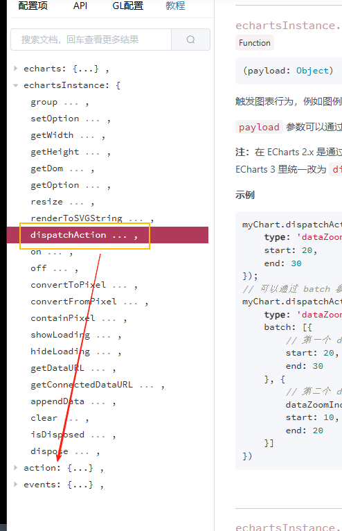
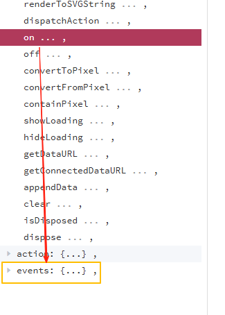

# echartsInstance

## 概述

+ 通过 echarts.init 创建的实例

+ 事件

  + `dispatchAction 行为` 可以为为自定义事件
  + 鼠标事件： 在鼠标点击某个图形上会触发

## echartsInstance属性之setOption

## echartsInstance属性之 dispatchAction 行为

+ 触发图表行为：类似于 `addEventListener`
+ 可以理解为自定义事件
+ 具体行为的配置详见 action

  

## echartsInstance属性之 on 事件

+ 绑定事件处理函数

  
