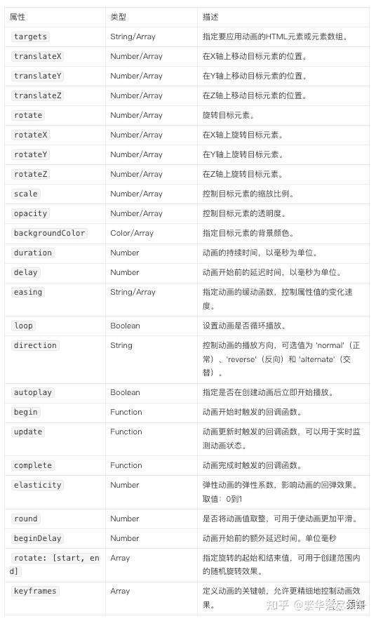

# 常用属性

## 概述

+ 常用属性

  

  + targets 指定要应用动画的HTML元素或元素数组 `String/Array`
  + translateX 在X轴上移动目标的位置 `String/Array`
  + translateY 在Y轴上移动目标的位置 `String/Array`
  + translateZ 在Z轴上移动目标的位置 `String/Array`
  + rotate 旋转目标元素 `String/Array`
  + rotateX 在X轴上旋转目标元素 `String/Array`
  + rotateY 在Y轴上旋转目标元素 `String/Array`
  + rotateZ 在Z轴上旋转目标元素 `String/Array`
  + scale 控制目标元素的缩放比例 `String/Array`
  + opacity 控制目标元素的透明度 `String/Array`
  + backgroundColor 指定目标元素的背景颜色 `Color/Array`
  + duration 动画的持续时间，以毫秒为单位 `Number`
  + easing 指定动画的缓动函数，控制属性值的变化速度 `String/Array`
  + loop 设置动画是否循环播放 `Boolean`
  + drection 控制动画的播放方向 `String`
  + autoplay 指定是否在创建动画后立即开始播放 `Boolean`
  + begin 动画开始时触发的回调函数 `Function`
  + update 动画更新时触发的回调函数，可以用于事实监测动画状态 `Function`
  + complete 动画完成是触发的回调函数 `Function`
  + elasticity 弹性动画的弹性系数，影响动画的回弹效果：取值 0-1 `Number`
  + round 是否将动画值取整，用于使动画更加平滑 `Number`
  + beginDely 动画开始前的额外盐池使劲按，单位毫秒 `Number`
  + rotate:[start, end] 指定旋转的起始和结束值，用于创建范围内的随机旋转效果 `Array`
  + keyframes 定义动画的关键帧，允许更精细的控制动画效果 `Array`
