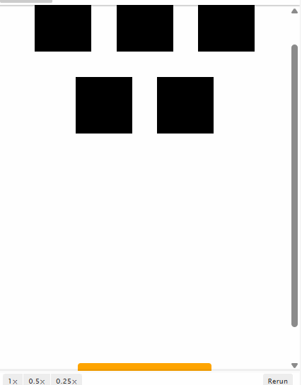

# 动画属性

## 类型1 css属性

+ 任何 CSS 属性都可以进行动画处理

  + opacity 透明度 0~1
  + backgroundColor
  + fontSize
  + borderRadius
  + backgroundColor

+ 大多数 CSS 属性将导致布局更改或重绘，并导致动画不连贯
+ 尽可能优先考虑不透明度和 CSS 转换

  + 一些常见的会引起重绘的属性比如：width、height、top、left、right、bottom 等

  ```js
  import { animate } from 'animejs';

  animate('.css-prop-demo .el',{
    left: '240px',
    backgroundColor: '#FFF',
    borderRadius: ['0%', '50%'],
    ease: 'inOutQuad'
  });
  ```

  

## 类型2 transforms属性动画

+ Animate CSS 将单独转换属性

  ```
  有效属性        默认单位
  translateX     px
  translateY     px
  translateZ     px
  rotate         deg / '1turn'（旋转一周）
  rotateX        deg
  rotateY        deg
  rotateZ        deg
  scale          — （scale:2   scale:0.5）
  scaleX         —
  scaleY         —
  scaleZ         —
  skew           deg
  skewX          deg
  skewY          deg
  perspective    px
  ```

  ```js
  import { animate } from 'animejs';

  animate('.css-transforms-demo .el',{
    translateX: 250,
    scale: 2,
    rotate: '1turn'
  });
  ```

  

## 类型3 对象属性

+ 任何包含数值的 Object 属性都可以进行动画处理

  ```js
  import { animate } from 'animejs';

  var objPropLogEl = document.querySelector('.item');

  var myObject = {
    prop1: 0,
    prop2: '0%'
  }

  animate(myObject,{
    prop1: 50,
    prop2: '100%',
    ease: 'linear',
    round: 1,
    onUpdate: function () {
      objPropLogEl.innerHTML = myObject.prop1 + '    ' + myObject.prop2;
    }
  });
  ```

  

+ 多个属性设置不同的动画

  ```js
  import { animate } from 'animejs';

  var indiParam = animate('.square',{
    translateY: {
      to: 250
    },
    rotate: {
      to: '2.125turn'
    },
    backgroundColor: {
      to: 'rgb(255,0,0)',
      duration: 400,
      delay: 1500,
      ease: 'linear'
    },
    duration: 1500,
    autoplay: false
  });

  document.querySelector('.play-indi').onclick = indiParam.restart;
  ```

  

## 方式4 DOM 属性

+ 任何包含数值的 DOM 属性都可以进行动画处理

  ```
  示例          值
  value         1000
  volume        0
  data-custom   '3 dogs'
  ```

  ```js
  import { animate } from 'animejs';

  animate('.dom-attribute-demo input',{
    value: [0, 1000],
    round: 1,
    ease: 'inOutExpo'
  });
  ```

  

## 方式5 SVG 属性
