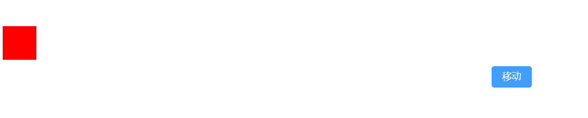
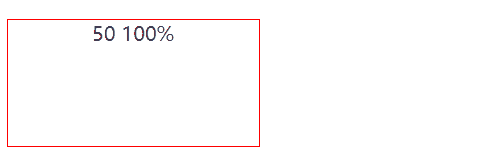

# 可动画的目标属性

## 方式1 css属性

+ 任何 CSS 属性都可以进行动画处理

+ 大多数 CSS 属性将导致布局更改或重绘，并导致动画不连贯。 尽可能优先考虑不透明度和 CSS 转换

  + 一些常见的会引起重绘的属性比如：width、height、top、left、right、bottom 等

  ```js
  anime({
    targets: '.css-prop-demo .el',
    left: '240px',
    backgroundColor: '#FFF',
    borderRadius: ['0%', '50%'],
    easing: 'easeInOutQuad'
  });
  ```

  

## 方式2 transforms属性动画

+ Animate CSS 将单独转换属性

  ```
  有效属性        默认单位
  translateX     px
  translateY     px
  translateZ     px
  rotate         deg
  rotateX        deg
  rotateY        deg
  rotateZ        deg
  scale          —
  scaleX         —
  scaleY         —
  scaleZ         —
  skew           deg
  skewX          deg
  skewY          deg
  perspective    px
  ```

  ```js
  anime({
    targets: '.css-transforms-demo .el',
    translateX: 250,
    scale: 2,
    rotate: '1turn'
  });
  ```

  

## 方式3 对象属性

+ 任何包含数值的 Object 属性都可以进行动画处理

  ```js
  var objPropLogEl = document.querySelector('.item');

  var myObject = {
    prop1: 0,
    prop2: '0%'
  }

  anime({
    targets: myObject,
    prop1: 50,
    prop2: '100%',
    easing: 'linear',
    round: 1,
    update: function () {
      objPropLogEl.innerHTML = myObject.prop1 + '    ' + myObject.prop2;
    }
  });
  ```

  

## 方式4 DOM 属性

+ 任何包含数值的 DOM 属性都可以进行动画处理

  ```
  示例          值
  value         1000
  volume        0
  data-custom   '3 dogs'
  ```

  ```js
  anime({
    targets: '.dom-attribute-demo input',
    value: [0, 1000],
    round: 1,
    easing: 'easeInOutExpo'
  });
  ```

  

## 方式5 SVG 属性
