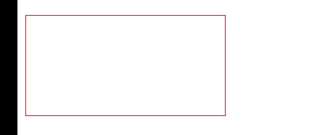

# 动画基础参数

## duration 运动时间

+ 定义动画的持续时间（以毫秒为单位）
+ 默认 1000

  ```
  Type            Default                                   Example
  Number          1000                                      3000
  anime.stagger   See staggering section                    anime.stagger(150)
  Function        See function based parameters section     (el, i) => i * 150
  ```

  ```js
  anime({
    targets: '.duration-demo .el',
    translateX: 250,
    duration: 3000 // 运动时间
  });
  ```

## delay 延迟

+ 定义动画的延迟（以毫秒为单位）

  ```
  Type                  Default                                     Example
  Number                0                                           1000
  anime.stagger         See staggering section                      anime.stagger(150)
  Function              See function based parameters section       (el, i) => i * 150
  ```

  ```js
  anime({
    targets: '.delay-demo .el',
    translateX: 250,
    delay: 1000
  });
  ```

## endDelay

+  末端延时，默认0毫秒

## easing  时间曲线

+ 默认值 `easeOutElastic(1, .5)`

+ 可选值

  + `linear` 匀速
  + 不匀速

    

  + 三次贝塞尔
  + 弹簧
  + 弹跳
  + 台阶 定义动画到达其结束值所需的跳转次数，例如：` easing: 'steps(5)'`
  + 自定义

    ```js
    anime({
      targets: '.custom-easing-demo .el',
      translateX: 270,
      direction: 'alternate',
      loop: true,
      duration: 2000,
      easing: function(el, i, total) {
        return function(t) {
          return Math.pow(Math.sin(t * (i + 1)), total);
        }
      }
    });
    ```

## round 四舍五入

+ round 四舍五入

  ```js
  anime({
    targets: '.item',
    innerHTML: [0, 100],
    easing: 'linear',
    round: 10 // 将动画值四舍五入到十进制1
    duration: 2000
  });
  ```

  

## 特殊属性

+ 使用Object作为值为动画的每个属性定义特定参数。未在Object中指定的其他属性继承自主动画

  ```js
  // 先在800毫秒内平移250px，然后在1800毫秒内旋转360度，最后放大两倍
  anime({
    targets: '.specific-prop-params-demo .el',
    translateX: {
      value: 250,
      duration: 800
    },
    rotate: {
      value: 360,
      duration: 1800,
      easing: 'easeInOutSine'
    },
    scale: {
      value: 2,
      duration: 1600,
      delay: 800,
      easing: 'easeInOutQuart'
    },
    delay: 250
  });
  ```

  
