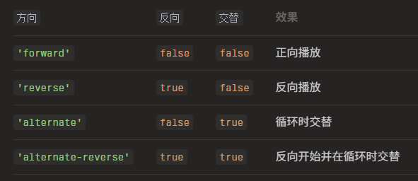

# 方向和循环

## direction 方向

+ normal，正方向动画（动画进度从 0 变为 100%）
+ reverse，反方向动画（动画进度从 100% 变为 0%）
+ alternate 往返动画（动画进度从 0% 变为 100%，然后又回到 0%）

+ direction 参数已被两个独立的参数取代：reversed 和 alternate

  + forward
  + reverse
  + alternate
  + alternate-reverse

  


  ```js
  waapi.animate('.square', {
    x: 100,
    reversed: true,
    alternate: true,
    loop: 3
  });
  ```

## loop 循环

+ 定义动画的迭代次数

+ 值

  + Number 迭代次数
  + true 无限循环

  ```js
  import { animate } from 'animejs';

  animate('.loop',{
    translateX: 270,
    loop: 3,
    ease: 'inOutSine'
  });

  animate('.loop-infinity',{
    translateX: 270,
    loop: true,
    ease: 'inOutSine'
  });

  animate('.loop-reverse',{
    translateX: 270,
    loop: 3,
    reversed: true,
    ease: 'inOutSine'
  });

  animate('.loop-reverse-infinity',{
    translateX: 270,
    reversed: true,
    loop: true,
    ease: 'inOutSine'
  });

  animate('.loop-alternate',{
    translateX: 270,
    loop: 3,
    alternate: true,
    ease: 'inOutSine'
  });

  animate('.loop-alternate-infinity',{
    translateX: 270,
    alternate: true,
    loop: true,
    ease: 'inOutSine'
  });
  ```

## autoplay： 自动播放

+ `true` 或 `false`
