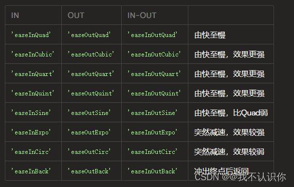

# easing 动画运动曲线

https://www.jianshu.com/p/39fc8a837b31

## 概述

+ `easing: 'linear'` 匀速
+ 默认值 `easeOutElastic(1, .5)`

## 方法

IN              OUT               IN-OUT            OUT-IN
'easeInQuad'    'easeOutQuad'    'easeInOutQuad'    'easeOutInQuad'
'easeInCubic'   'easeOutCubic'   'easeInOutCubic'   'easeOutInCubic'
'easeInQuart'   'easeOutQuart'   'easeInOutQuart'   'easeOutInQuart'
'easeInQuint'   'easeOutQuint'   'easeInOutQuint'   'easeOutInQuint'
'easeInSine'    'easeOutSine'    'easeInOutSine'    'easeOutInSine'
'easeInExpo'    'easeOutExpo'    'easeInOutExpo'    'easeOutInExpo'
'easeInCirc'    'easeOutCirc'    'easeInOutCirc'    'easeOutInCirc'
'easeInBack'    'easeOutBack'    'easeInOutBack'    'easeOutInBack'
'easeInBounce'  'easeOutBounce'  'easeInOutBounce'  'easeOutInBounce'

  

  + [如何的变化](https://codepen.io/juliangarnier/pen/mWdraw)

  ```js
  anime({
    targets: '.custom-easing-demo .el',
    translateX: 270,
    direction: 'alternate',
    loop: true,
    duration: 2000,
    easing: 'easeInBounce'
  });
  ```

+ 可选值

  + `linear` 匀速
  + 不匀速

    

  + 三次贝塞尔
  + 弹簧
  + 弹跳
  + 台阶 定义动画到达其结束值所需的跳转次数，例如：` easing: 'steps(5)'`
  + 自定义

    ```js
    anime({
      targets: '.custom-easing-demo .el',
      translateX: 270,
      direction: 'alternate',
      loop: true,
      duration: 2000,
      easing: function(el, i, total) {
        return function(t) {
          return Math.pow(Math.sin(t * (i + 1)), total);
        }
      }
    });
    ```

## BÉZIER曲线和spring弹簧

+ 二者都是参数改变变化的曲线

+ `easing: 'cubicBezier(.5, .05, .1, .3)'` 方法接收4个参数，通过参数来改变运动曲线

+ `easing: 'spring(mass, stiffness, damping, velocity)'`

  + mass 质量
  + stiffness 高度
  + damping 阻尼
  + velocity 速度

属性        默认值    MIN   MAX
Mass        1       0     100
Stiffness   100     0     100
Damping     10      0     100
Velocity    0       0     100

## ELASTIC

+ `easing: 'easeOutElastic(amplitude, period)'` 也是表示弹簧，只不过弹的方向不一样

  + amplitude 振幅
  + period 来回的次数

IN                 OUT                IN-OUT                  OUT-IN
'easeInElastic'   'easeOutElastic'    'easeInOutElastic'      'easeOutInElastic'

属性          默认值     MIN     MAX
Amplitude    1         1       10
Period       .5        0.1     2

## 跳动

+ `easing: 'steps(numberOfSteps)'` numberOfSteps跳动的步数

属性                默认值     MIN    MAX
Number of steps    10        1      ∞

+ 注意返回的一定是个函数

  ```js
  anime({
    targets: '.custom-easing-demo .el',
    translateX: 270,
    direction: 'alternate',
    loop: true,
    duration: 2000,
    easing: function(el, i, total) {
      return function(t) {
        return Math.pow(Math.sin(t * (i + 1)), total);
      }
    }
  });
  ```


