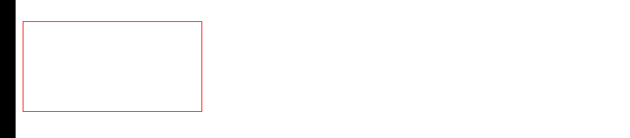

# 相对

## 概述

+ 添加，减去或乘以原始值
+ 有 `+=` 、 `-=` 、 `*=` 这三个值

  ```
  接受     含义    例
  '+='    加     '+=100'
  '-='    减     '-=2turn'
  '*='    乘     '*=10'
  ```

  ```js
  // 宽度变为原来的两倍，高度度减少50px
  var relativeEl = document.querySelector('.el.relative-values');
  relativeEl.style.transform = 'translateX(100px)';

  anime({
    targets: '.el.relative-values',
    translateX: {
      value: '*=2.5', // 100px * 2.5 = '250px'
      duration: 1000
    },
    width: {
      value: '-=20px', // 28 - 20 = '8px'
      duration: 1800,
      easing: 'easeInOutSine'
    },
    rotate: {
      value: '+=2turn', // 0 + 2 = '2turn'
      duration: 1800,
      easing: 'easeInOutSine'
    },
    direction: 'alternate'
  });
  ```

  ```js
  translateY: [
    { value: 100, duration: 500 }, // 100
    { value: "+=100", duration: 1000, delay: 1000 }, // 200
    { value: "+=100", duration: 1000, delay: 1000 }, // 300
    { value: 40, duration: 500, delay: 1000 }, // 40
  ],
  ```


  
