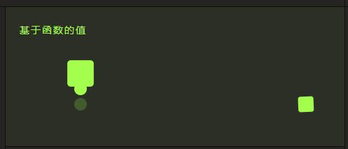

# 基于函数的值

## 概述

+ 为动画的每个目标和属性设置不同的值。函数接收三个参数，分别是

  + target，目标元素
  + index，动画目标的索引
  + targetsLength，总动画目标数

  ```js
  animate('.function-based-values-demo .el',{
    translateX: function(el) {
      return el.getAttribute('data-x');
    },
    translateY: function(el, i) {
      return 50 + (-50 * i);
    },
    scale: function(el, i, l) {
      return (l - i) + .25;
    },
    rotate: function() { return utils.round(-360, 360); },
    borderRadius: function() { return ['50%', utils.round(10, 35) + '%']; },
    duration: function() { return utils.round(1200, 1800); },
    delay: function() { return utils.round(0, 400); },
    alternate: true,
    loop: true
  });
  ```

  
