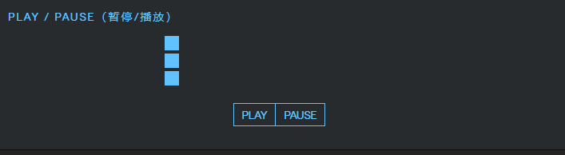

# 播放与暂停

## 播放与暂停

+ 需要将自动播放 `autoplay` 设置为 `false`

  ```js
  //播放
  animation.play();
  //暂停
  animation.pause();
  ```

  ```js
  var animation = anime({
    targets: '.play-pause-demo .el',
    translateX: 270,
    delay: function(el, i) { return i * 100; },
    direction: 'alternate',
    loop: true,
    autoplay: false,
    easing: 'easeInOutSine'
  });

  document.querySelector('.play-pause-demo .play').onclick = animation.play;
  document.querySelector('.play-pause-demo .pause').onclick = animation.pause;
  ```

  
