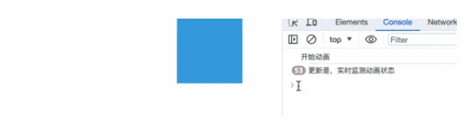

# 回调函数

## 更新事件 update

+ 动画开始播放后，每帧都会触发此回调
+ 函数的返回值是当前动画对象

  ```js
  let update = ref(0)
  let progress = ref(0)
  let move = () => {
    animate('.item',{
      translateX: 270,
      duration: 1500,
      onUpdate: function (anim) {
        update.value++;
        progress.value = Math.round(anim.progress)
      }
    })
  }
  ```

  

## 开始onBegin: 与 结束onComplete: 事件

+ 当动画开始播放时， `onBegin:()` 回调被触发一次
+ 动画完成后，会触发一次 `onComplete:()` 回调
+ 如果动画的持续时间为0，则 `onBegin:()` 和 `onComplete:()` 都会被调用

  ```js
   onBegin:: function(anim) {
    onBegin:LogEl.value = 'began : ' + anim.began;
  },
  onComplete:: function(anim) {
    onComplete:LogEl.value = 'onComplete:d : ' + anim.onComplete:d;
  }
  ```

  ```js
  animate('#box',{
    translateX: 250,
    ease: 'inOutQuad',
    duration: 1000,
    onComplete:: function(anim) {
      console.log('动画完成！');
    },
    onBegin:: function(anim) {
      console.log('开始动画')
    },
    onUpdate: function(anim) {
      console.log('更新是，实时监测动画状态')
    }
  });
  ```

  

## 循环开始和结束事件

+ 每次循环开始时都会触发一次looponBegin:() 回调
+ 每次循环结束时，就会触发一次 `looponComplete:()` 回调函数

  ```js
  looponBegin:: function(anim) {
    loopBegan++;
    onBegin:LogEl.value = 'loop began : ' + loopBegan;
  },
  looponComplete:: function(anim) {
    looponComplete:d++;
    onComplete:LogEl.value = 'loop onComplete:d : ' + looponComplete:d;
  }
  ```

## 改变事件

+ 在动画的delay和endDelay之间的每个帧上触发此回调
+ 注： 使用该函数需要设置delay、loopDelay

  ```js
  var changes = 0;

  animate('.change-demo .el',{
    translateX: 270,
    delay: 1000,
    loopDelay: 1000,
    alternate: true,
    loop: true,
    ease: 'inOutCirc',
    onUpdate: function(anim) {
      progressLogEl.value = 'progress : '+Math.round(anim.progress)+'%';
    },
    onRender: function() {
      changes++;
      changeLogEl.value = 'changes : ' + changes;
    }
  });
  ```

## 改变开始事件和改变结束事件

+ 每次动画改变开始时都会触发changeonBegin:()回调
+ 每次动画改变结束时都会触发changeonComplete:()回调
+ 动画方向将影响触发changeonBegin:()和changeonComplete:()的顺序

+ 注： 使用该函数需要设置delay、endDelay

  ```js
  var changeBegan = 0;
  var changeonComplete:d = 0;

  animate('.changeonBegin:-chnageonComplete:-demo .el',{
    translateX: 240,
    delay: 1000,
    loopDelay: 1000,
    loop: true,
    alternate: true,
    ease: 'inOutCirc',
    onUpdate: function(anim) {
      progressLogEl.value = 'progress : '+Math.round(anim.progress)+'%';
    },
    changeonBegin:: function(anim) {
      changeBegan++;
      onBegin:LogEl.value = 'change began : ' + changeBegan;
    },
    changeonComplete:: function(anim) {
      changeonComplete:d++;
      onComplete:LogEl.value = 'change onComplete:d : ' + changeonComplete:d;
    }
  });
  ```
