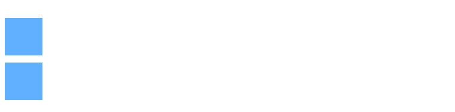
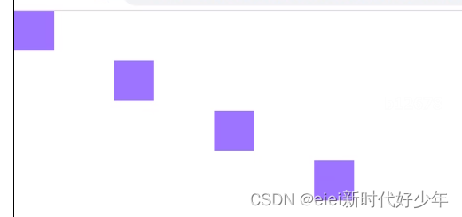

# 基础交错动画

## API

+ `anime.stagger(value, options)` 它针对多个元素

  + `anime.stagger(value, {start: startValue})`
  + `anime.stagger([startValue, endValue])`
  + `anime.stagger(value, {from: startingPosition})`
  + `anime.stagger(value, {reversed: true,})`
  + `anime.stagger(value, {grid: [rows, columns]})`

  + value: 接收 `Number` , `String` , `Array`
  + options: 接收 `Objectt`

  ```js
  animate('.item',{
    translateX: 270,
    delay: anime.stagger(1000) // 每个元素的延迟增加1000毫秒
  })
  ```

  
  

  ```js
  animate('.item',{
    translateX: anime.stagger(100),
    delay: anime.stagger(100) // 每个元素的延迟增加100毫秒
  })
  ```

  

## 对比

+ 对比1:正向

  ```js
  // A function to introduce animation delay in elements.
  delay: function(target, index) {
    return index * 200;
  }

  // The stagger() Equivalent
  delay: anime.stagger(200);
  ```

+ 对比2:反向

  ```js
  // Reversing the delay direction
  delay: function(target, index, targetCount) {
    return (targetCount - index) * 200;
  }
  // Equivalent functionality with stagger()
  delay: anime.stagger(200, {reversed: true,})
  ```

+ 对比3:

  ```js
  // Duration starts at 1000 and increases by 800
  duration: function(target, index) {
    return 1000 + index * 800;
  }

  // Equivalent functionality with stagger()
  duration: anime.stagger(800, {"start": 1000})
  ```

+ 对比4:反方向

  ```js
  // A non-zero duration in reverse direction
  duration: function(target, index, targetCount) {
    return 1000 + (targetCount - index) * 800;
  }
  // Equivalent functionality with stagger()
  duration: anime.stagger(800, {"start": 1000, "direction": "reverse"})
  ```
