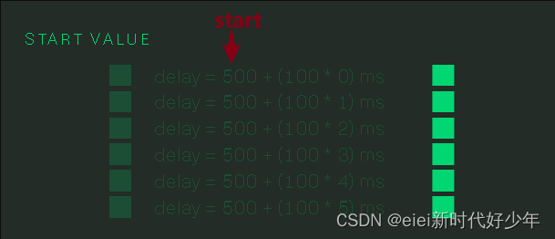

# 设定交错开始值

## 概述

+ `anime.stagger(value, {start: startValue})`

+ 从特定值开始产生交错效果

  ```js
  anime({
    targets: '.staggering-start-value-demo .el',
    translateX: 270,
    delay: anime.stagger(100, {start: 500}) // 延迟从500ms开始，然后每个元素增加100ms
  });
  ```

  
