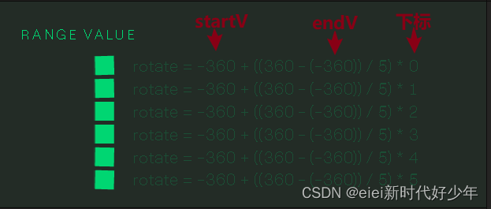
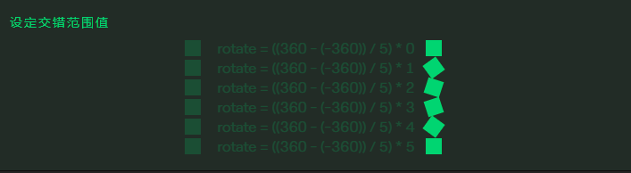

# 设定交错范围值

## 概述

+ `anime.stagger([startValue, endValue])`

+ 在两个数字之间均匀分配值

  ```js
  anime({
    targets: '.range-value-staggering-demo .el',
    translateX: 270,
    rotate: anime.stagger([-360, 360]), // 旋转将在-360deg到360deg之间均匀分布在所有元素之间
    easing: 'easeInOutQuad'
  });
  ```

  
  
