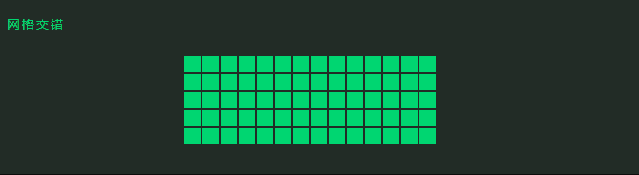

# 网格交错及方向

## 网格交错

+ `anime.stagger(value, {grid: [rows, columns]})`

+ 基于数组的交错值，以产生“波纹”效应
+ 两个值的数组，第一个值是列数，第二个值是行数

  ```js
  animate('.staggering-grid-demo .el',{
    scale: [
      {to: .1, ease: 'outSine', duration: 500},
      {to: 1, ease: 'inOutQuad', duration: 1200}
    ],
    delay: anime.stagger(200, {grid: [14, 5], from: 'center'})
  });
  ```

  


## 网格交错方向

+ `anime.stagger(value, {grid: [rows, columns], axis: 'x'})`

  + axis
    + 设置为x，表示将一整行设置为整体
    + 设为y，会将一整列设置为整体

  ```js
  animate('.staggering-axis-grid-demo .el',{
    translateX: anime.stagger(10, {grid: [14, 5], from: 'center', axis: 'x'}),
    translateY: anime.stagger(10, {grid: [14, 5], from: 'center', axis: 'y'}),
    rotateZ: anime.stagger([0, 90], {grid: [14, 5], from: 'center', axis: 'x'}),
    delay: anime.stagger(200, {grid: [14, 5], from: 'center'}),
    ease: 'inOutQuad'
  });
  ```

  
