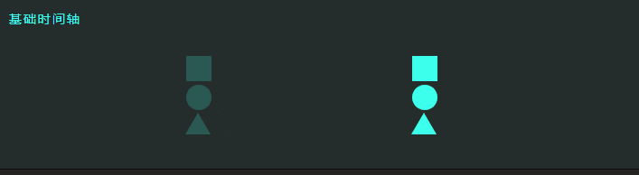

# 时间轴

## 概述

+ 时间轴可让你将多个动画同步在一起
+ 默认情况下，添加到时间轴的每个动画都会在上一个动画结束时开始

## anime.timeline 创建时间轴

+ 创建时间轴

  ```js
  var myTimeline = anime.timeline(parameters);
  ```

## add() 将动画添加到时间轴

+ 将动画添加到时间轴

  ```js
  myTimeline.add(parameters, offset);
  ```

## 示例

+ 示例1

  ```js
  // 使用默认参数创建时间轴
  var tl = anime.timeline({
    easing: 'easeOutExpo',
    duration: 750
  });

  // 增加子项
  tl
  .add({
    targets: '.basic-timeline-demo .el.square',
    translateX: 250,
  })
  .add({
    targets: '.basic-timeline-demo .el.circle',
    translateX: 250,
  })
  .add({
    targets: '.basic-timeline-demo .el.triangle',
    translateX: 250,
  });
  ```

  
