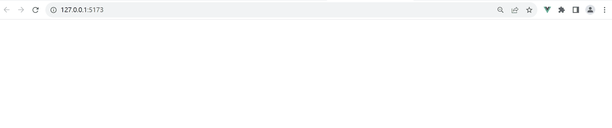

# 方法

## gsap.to()

+ gsap.to()

  + 这是GSAP中最常用的方法之一，用于从当前属性值过渡到目标属性值
  + 可以指定动画的持续时间、延迟时间、缓动函数等参数

    ```js
    gsap.to('.box', {
      x: 200,
      y: 100,
      duration: 1,
      repeat: 2,
      yoyo: true,
      delay: 0.5,
      ease: 'power1.out',
    });
    ```

  

## gsap.from()

+ gsap.from()

  + 与gsap.to()类似，但是它从指定的属性值开始过渡到当前属性值

    ```js
    gsap.from('.box', {
      opacity: 0,
      duration: 1,
      delay: 0.5,
      ease: 'power2.inOut',
    });
    ```

## gsap.set()

+ gsap.set()

  + 用于将元素的属性值设置为指定的值，没有动画效果

## gsap.fromTo()

+ gsap.fromTo()

  + 结合gsap.from()和gsap.to()的功能，可以同时设置起始值和目标值，实现更复杂的动画效果

    ```js
    gsap.fromTo('.box',
      {
        opacity: 0,
        x: -100,
      },
      {
        opacity: 1,
        x: 100,
        duration: 1,
        delay: 0.5,
        ease: 'power3.inOut',
      }
    );
    ```

  

