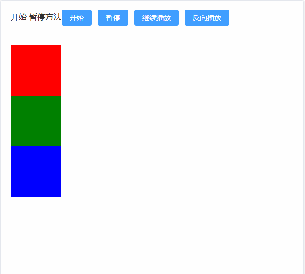

# 控制方法

## 概述

+ 控制方式

  ```js
  // retain animation reference to control later
  let anim = gsap.to(...); // or gsap.timeline(...);
  // most methods can be used as getters or setters
  anim.play() // 开始播放
    .pause() // 暂停
    .resume() // 继续播放
    .reverse() // 反向播放
    .restart()
    .timeScale(2) // 2 = double speed, 0.5 = half speed
    .seek(1.5) // jump to a time (in seconds) or label
    .progress(0.5) // jump to halfway
    .totalProgress(0.8) // includes repeats
    // when used as setter, returns animation (chaining)

    // other useful methods (tween and timeline)
    .kill() // immediately destroy
    .isActive() // true if currently animating
    .then() // Promise
    .invalidate() // clear recorded start/end values
    .eventCallback() // get/set an event callback

    // timeline-specific methods
    // add label, tween, timeline, or callback
    .add(thing, position)
    // calls function at given point
    .call(func, params, position)
    // get an Array of the timeline's children
    .getChildren()
    // empties the timeline
    .clear()
    // animate playhead to a position linearly
    .tweenTo(timeOrLabel, {vars})
    // ^^ with both start and end positions
    .tweenFromTo(from, to, {vars})
  ```

## play() 播放

+ 播放

  ```js
  const tween = gsap.to('.red', {
    x: 500,
    duration: 5,
    paused: true
  })

  btn1.onclick = function() {
    tween.play()
  }
  ```

## pause() 暂停

+ 暂停

  ```js
  const tween = gsap.to('.red', {
    x: 500,
    duration: 5,
    paused: true
  });

  btn2.onclick = function() {
    tween.pause()
  }
  ```

## resume() 继续播放

+ `resume()` 会沿着当前的方向进行继续播放， `play()` 都是正向的播放

  

  ```js
  import gsap from "gsap";
  const tween = gsap.to('.red', {
    x: 500,
    duration: 5,
    paused: true
  });

  btn3.onclick = function() {
    tween.resume()
  }
  ```

## reverse() 反向播放

+ 反向播放

  ```js
  import gsap from "gsap";
  const tween = gsap.to('.red', {
    x: 500,
    duration: 5,
    paused: true
  })

  btn4.onclick = function() {
    // 反向播放
    if (!tween.isActive()) {
      tween.reverse()
    }
    // console.log( tween.isActive() )
  }
  ```
