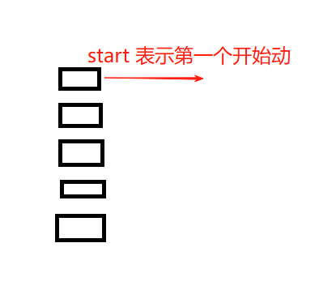

# Stagger 配置

## 概述

+ 交错时间

## stagger 常规配置

+ 参数为 数字

  ```js
  // 第一个直接开始
  // 第二个元素要等待第一个元素 0.1秒后开始
  // 第三个元素要等待第二个元素 0.1 秒后开始(也就是 0.1+0.1 秒后开始)
  gsap.to(['.box1', '.box2', '.box3'], {
    x: 100, // any properties (not limited to CSS)
    duration: 1, // seconds
    stagger: 0.1,
    repeat: -1, // 同时针对整体
    yoyo: true // 同时针对整体
  });
  ```

## 高级配置

+ 参数为 对象：可以为每个元素单独设置 `repeat` `yoyo`

  ```js
  gsap.to(['.box1', '.box2', '.box3'], {
    x: 100, // any properties (not limited to CSS)
    duration: 1, // seconds
    stagger: {
      each: 0.1, // 相当于 外部的 stagger: 0.1
      repeat: -1, // 针对每个元素设置的重复，而不是整体的重复，所以不用等其他动画完成后再进行
      yoyo: true // 针对每个元素设置
    }
  });
  ```

+ 高级配置

  + amount 设置交错总量
  + from 设置从那个元素开始动画

    + start 默认值

      

    + end
    + center

    ```js
    gsap.to('.box', {
      x: 500,
      stagger: {
        amount: 1, // 设置交错总量，如果有10元素，相当于每个元素的each为 0.1
        from: 'center', // start end
        grid: [4, 3],
        axis: 'x'
      }
    })
    ```

