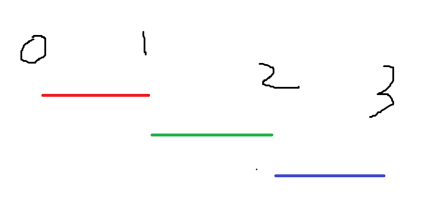
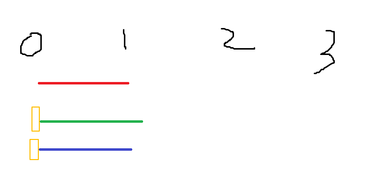
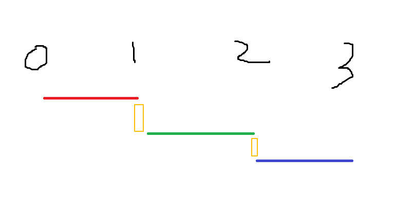
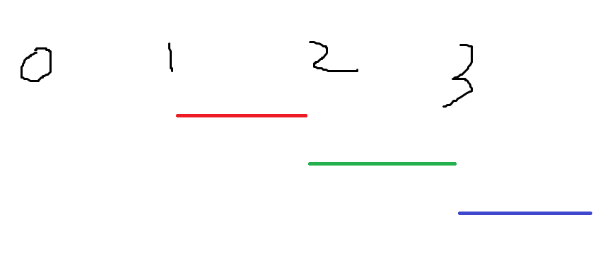
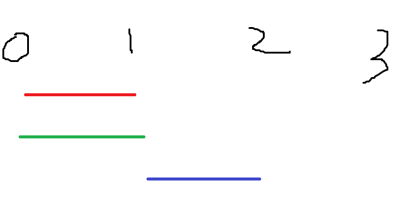

# 时间线位置参数

## 概述

+ 时间线位置参数 positionParameter

  

  ```js
  // position parameter (controls placement)
  tl.to(target, { toVars }, positionParameter);

  0.7; // exactly 0.7 seconds into the timeline (absolute)
  ('-=0.7'); // overlap with previous by 0.7 sec
  ('myLabel'); // insert at "myLabel" position
  ('myLabel+=0.2'); // 0.2 seconds after "myLabel"
  ('<'); // 跟着上一个动画的起始位置
  ('<0.2'); // 0.2 seconds after ^^
  ('-=50%'); // overlap half of inserting animation's duration
  ('<25%'); // 25% into the previous animation (from its start)
  ```

## <

+ 跟着上一个动画的起始位置开始

  ```js
  tl.to('.red', {}, 0)
    .to('.green', '<')
    .to('.blue', '<');

  // 等于
  tl.to('.red', {}, 0)
    .to('.green', 0)
    .to('.blue', 0);
  ```

  

## >

+ 跟着上一个动画的结束位置开始
+ 和默认的效果一样

  ```js
  tl.to('.red', {}, 0)
    .to('.green', '>')
    .to('.blue', '>');

  // 等于
  tl.to('.red', {}, 0)
    .to('.green')
    .to('.blue');
  ```

  

## +=

+ 上一个动画结束后延迟一段时间

  ```js
  tl.to('.red', {}, 0)
    .to('.green', '+=1'); // 上一个动画结束后延迟1秒后执行
    .to('.blue', '+=2'); // 上一个动画结束后延迟2秒后执行
  ```

## 示例

+ 示例1

  ```js
  const tl = gsap.timeline({
    defaults: {
      x: 500,
      duration: 1
    }
  });

  tl.to('.red', {}, 0)
    .to('.green', {})
    .to('.blue', {})
  ```

  

+ 示例2：第一个设置时间位置参数为1，相当于等待1秒后执行

  ```js
  const tl = gsap.timeline({
    defaults: {
      x: 500,
      duration: 1
    }
  });

  tl.to('.red', {}, 1)
    .to('.green', {})
    .to('.blue', {})
  ```

  

+ 示例3：第一个和第二个设置时间位置参数为0，相当第一个和第二个同时执行

  ```js
  const tl = gsap.timeline({
    defaults: {
      x: 500,
      duration: 1
    }
  });

  tl.to('.red', {}, 0)
    .to('.green', {}, 0)
    .to('.blue', {})
  ```

  

