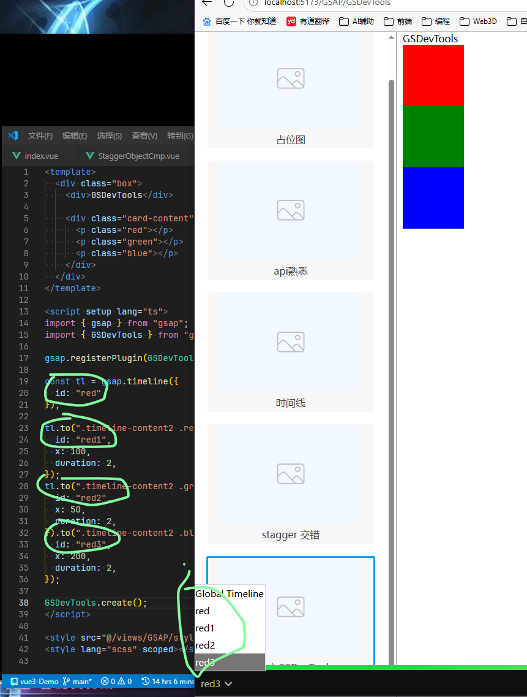
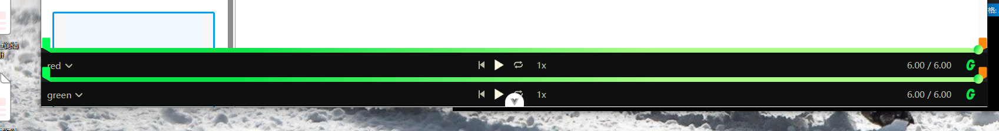

# GSDevTools 调试

## 概述

+ 基本使用

  ```js
  import { gsap } from 'gsap'
  import { GSDevTools } from 'gsap/GSDevTools'

  gsap.registerPlugin(GSDevTools);

  GSDevTools.create()
  ```

## 时间线添加id

+ 方便调试

  ```js
   const tl = gsap.timeline({
    id: 'red',
  });

  tl.to(".timeline-content2 .red", {
    id: 'red1',

  });
  tl.to(".timeline-content2 .green", {
    id: 'red2',

  }).to(".timeline-content2 .blue", {
    id: 'red3',

  });
  ```

  

## 多个时间线区分

+ 设置属性区分

  ```js
  // 设置第一个时间线为 tl，同时控制台距离底部50px
  GSDevTools.create({ animation: tl, css: { bottom: "50px" } });
  GSDevTools.create({ animation: t2 });
  ```

  

## 示例

+ 示例1


  ```js
  import { gsap } from 'gsap'
  import { GSDevTools } from 'gsap/GSDevTools'

  gsap.registerPlugin(GSDevTools);

  const tl = gsap.timeline({
    id: 'red',
  });

  tl.to(".timeline-content2 .red", {
    id: 'red1',
    x: 100,
    duration: 2,
  });
  tl.to(".timeline-content2 .green", {
    id: 'red2',
    x: 50,
    duration: 2,
  }).to(".timeline-content2 .blue", {
    id: 'red3',
    x: 200,
    duration: 2,
  });

  GSDevTools.create()
  ```
