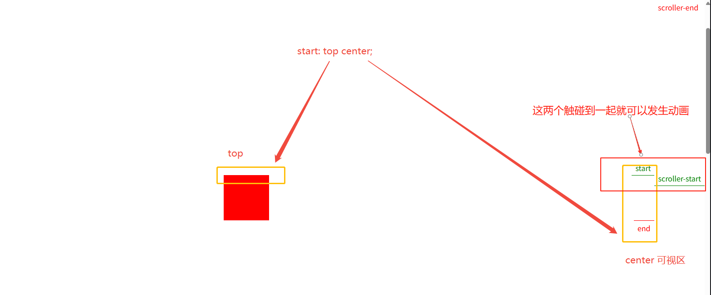

# ScrollTrigger滚动

## 概述

+ 滚动条相关
+ 效果：产生视觉差

+ 基本使用

  ```js
  import { gsap } from 'gsap'
  import { ScrollTrigger } from 'gsap/ScrollTrigger'

  gsap.registerPlugin(ScrollTrigger)

  gsap.to('.box', {
    x: 500,
    duration: 4,
    scrollTrigger: {
      trigger: '.box',
      start: 'top center',
      toggleActions: 'restart pause resume reset',
      scrub: true,
      scrub: 1,
      pin: true,
      markers: true,
    }
  })
  ```

## 使用方式1 目标为单个元素

+ 值为选择器：目标元素进入可视范围内才能触发动画

  ```js
  import { gsap } from "gsap";
  import { ScrollTrigger } from "gsap/ScrollTrigger";

  gsap.registerPlugin(ScrollTrigger);

  gsap.to(".scrollTrigger .red", {
    x: 500,
    duration: 2,

    // 目标元素
    scrollTrigger: ".scrollTrigger .red",
  });
  ```

## 使用方式2 目标为集合

+ 目标为集合

  ```js
  const boxs = gsap.utils.toArray("p")!;
  console.log(boxs);

  boxs.forEach(item => {
    gsap.to(item, {
      x: 500,
      duration: 2,
      scrollTrigger: item,
      // scroller: "aside",
      // pinType: "transform",
    });
  });
  ```

## 使用方式3 时间线

+ 时间线

  ```js
  const tl = gsap.timeline({
    scrollTrigger: ".red",
  });

  tl.to(".red", {
    x: 500,
    duration: 2,
    scrollTrigger: {
      trigger: ".red",
      // markers: true, // 参考线
      // start: "top center",
    },
    // scrollTrigger: ".red", // 目标元素进入到可视区内，动画元素执行
  });
  ```

## 使用方式4 对象

+ 值为对象

+ 参数

  + toggleActions 触发器的行为 默认 `play none none none`

    + 参数1 播放： start 进入时的行为
    + 参数2 end 离开时的行为
    + 参数3 end 进入时的行为
    + 参数4 start 离开时的行为

    + 值

      + play 播放
      + none 不触发行为
      + restart 重新播放
      + pause 暂停
      + resume 继续播放
      + reset 重置

  + start

    + start: 100,  // 滚动条的位置
    + `start: 'top center'` // top: 控制trigger的元素 center可视区

      


  + end

  + scrub 与滚动条方向匹配的参数

  ```js
  gsap.to('.green', {
    x: 500,
    duration: 5,
    scrollTrigger: {
      trigger: '.green',
      //start: 100,  // 滚动条的位置
      start: 'top center', // top: 控制trigger的元素 center可视区
      markers: true,  // 参考线
      //toggleActions: 'play none none none',  // 触发器的行为 默认：play播放
      //toggleActions: 'play pause resume pause',  // start进入 end离开 end进入 start离开
      toggleActions: 'restart pause resume reset',
      //scrub: true,  // 跟滚动条方向匹配的参数
      //scrub: 1,  // 惯性1秒
      pin: true,  // 固定位置
    }
  })
  ```

