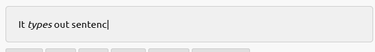

# 基础

## 概述

+ Typed.js 是一个用于键入的库

  

+ [源码地址](https://github.com/mattboldt/typed.js/?tab=readme-ov-file)

## 安装

+ npm

  ```bash
  # With NPM
  npm install typed.js

  # With Yarn
  yarn add typed.js

  # With Bower
  bower install typed.js
  ```
